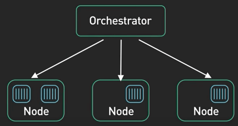
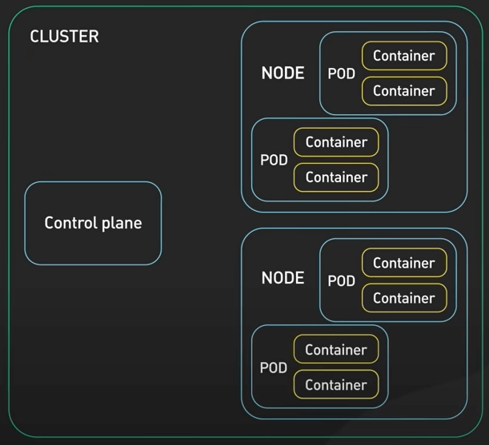
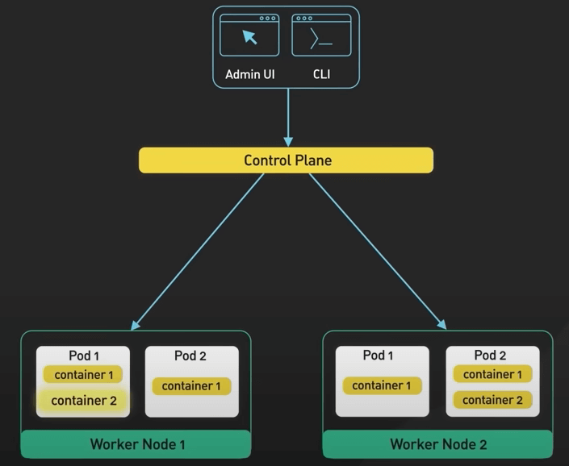
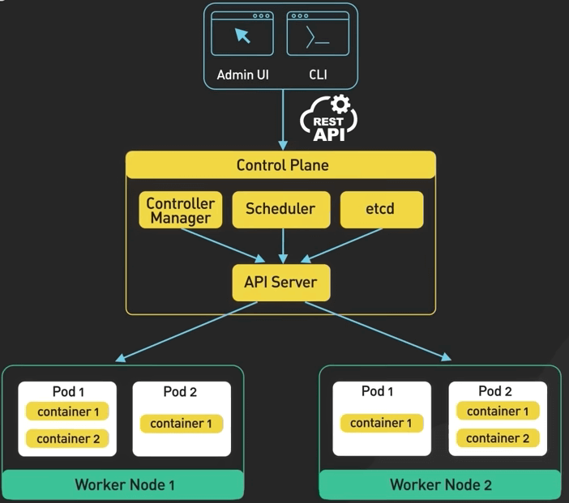
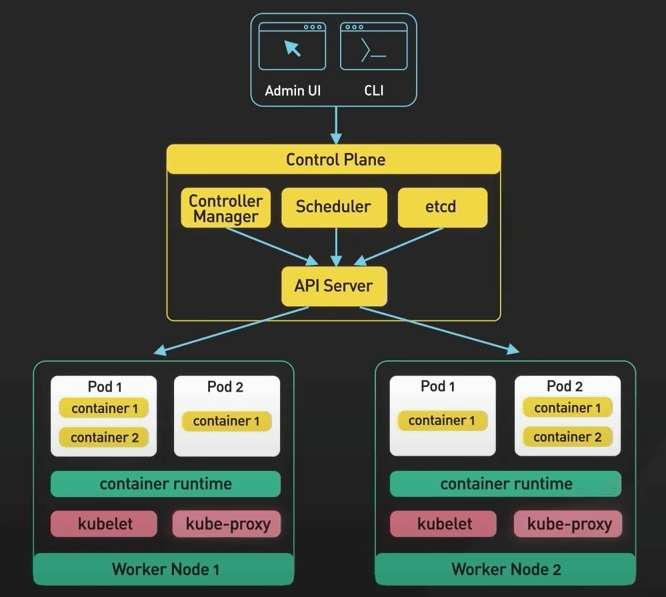
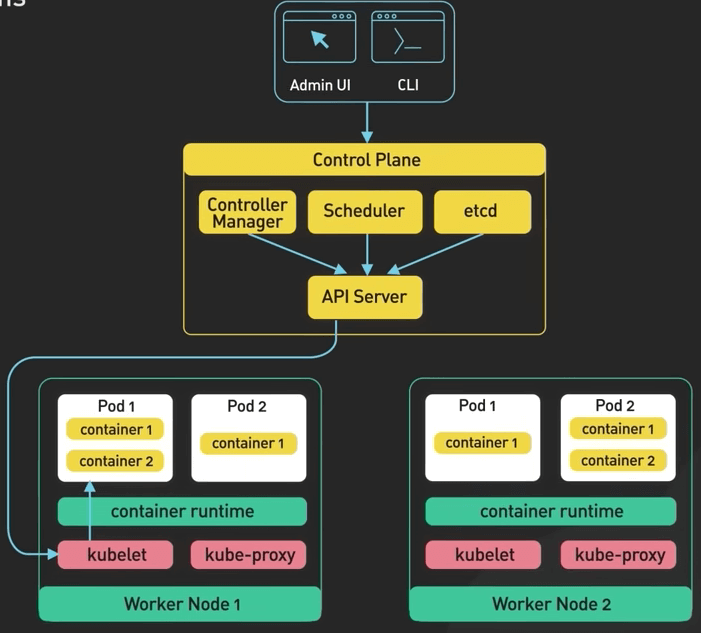

# Kiến trúc Kubernetes

## Nguồn

 [Kubernetes Explained in 6 Minutes | k8s Architecture](https://www.youtube.com/watch?v=TlHvYWVUZyc)

## Kubernetes là gì?

**Kubernetes** là một nền tảng điều phối container mã nguồn mở. Nó tự động hoá việc deploy, mở rộng quy mô và quản lý các ứng dụng được đóng gói.

{ style="display: block; margin: 0 auto" }

{ style="display: block; margin: 0 auto" }

Kubernetes có khởi điểm là hệ thống điều phối container nội bộ của Google, tên là **Borg**. Nó quản lý việc triển khai hàng ngàn ứng dụng trong nội bộ Google. Vào năm 2014, Google công bố một phiên bản mã nguồn mở của Borg, đó chính là Kubernetes.

{ style="display: block; margin: 0 auto" }

Sao nó lại được gọi là **k8s**? Tương tự với *i18n* với *internationalization* và *l10n* với *localization*, số 8 trong **k8s** chỉ 8 ký tự nằm giữa chữ **k** và **s** trong kubernetes.

## Các thành phần trong Kubernetes

Một cụm Kubernetes là một tập các máy, gọi là các node, được dùng để chạy các ứng dụng được đóng gói. 

{ style="display: block; margin: 0 auto" }

Có hai phần cốt lõi trong một cụm Kubernetes. Đầu tiên là phần điều khiển (control plane). Nó chịu trách nhiệm quản lý trạng thái của cụm. Trong môi trường thực tế, control plane thường chạy trên nhiều node, trải rộng trên một số vùng data center. 

{ style="display: block; margin: 0 auto" }

Thứ hai là các worker node. Các node này chạy việc cho ứng dụng được đóng gói. Các ứng dụng được đóng gọi chạy trong một Pod. 

{ style="display: block; margin: 0 auto" }

Pod là đơn vị triển khai nhỏ nhất trong Kubernetes. Một pod sẽ host một hoặc nhiều container và cung cấp bộ nhớ dùng chung cũng như kết nối mạng cho các container đó. Các pod được tạo ra và quản lý bởi control plane của Kubernetes. Chúng là các kết cấu cơ bản của các ứng dụng Kubernetes.

### Control Plane

Control plane bao gồm một số thành phần chính. Chúng là **API server**, **etcd**, **bộ lập lịch** và **trình quản lý bộ điều khiển**.

API server là interface chính giữa control plane và phần còn lại của cụm. Nó mở một API RESTful cho phép các client tương tác với control plane và gửi các request để quản lý cụm. etcd là một kho lưu trữ key-value từ xa. Nó lưu trữ trạng thái của cụm. Nó được dùng bởi API server và các thành phần khác của control plane để lưu và lấy thông tin về cụm.

{ style="display: block; margin: 0 auto" }

{ style="display: block; margin: 0 auto" }

Bộ lập lịch chịu trách nhiệm lập lịch cho các pod trên các worker node trong cụm. Nó sử dụng thông tin về tài nguyên cần bởi các pod và tài nguyên đang có trên các worker node để đưa ra quyết định phân phối.

Trình quản lý bộ điều khiển chịu trách nhiệm chạy các bộ điều khiển quản lý trạng thái của cụm. Một số ví dụ bao gồm bộ điều khiển sao chép: đảm bảo số lượng bản sao của một pod đang hoạt động; và bộ điều khiển triển khai: quản lý cập nhật luân phiên và rollback các triển khai.

### Worker Node

Tiếp theo, ta hãy đi sâu vào các worker node. Các thành phần cốt lõi của Kubernetes chạy trên worker node bao gồm **kubelet**, **container runtime** và **kube-proxy**. 

{ style="display: block; margin: 0 auto" }

Kubelet là một daemon chạy trên mỗi worker node. Nó chịu trách nhiệm giao tiếp với control plane. Nó nhận chỉ thị từ control plane về việc các pod nào sẽ chạy trên node và đảm bảo rằng trạng thái mong muốn trên pod được duy trì.

{ style="display: block; margin: 0 auto" }

Container runtime chạy các container trên các worker node. Nó chịu trách nhiệm kéo container image từ registry, chạy và dừng các container, và quản lý tài nguyên của các container. 

Kube-proxy là một proxy mạng chạy trên mỗi worker node. Nó chịu trách nhiệm định tuyến lưu lượng đến đúng pod. Nó cũng cung cấp cân bằng tải cho các pod và đảm bảo lưu lượng được phân phối đều trên các pod.

## Điểm mạnh và điểm yếu

Vậy khi nào ta cần dùng Kubernetes? Như nhiều thứ trong công nghệ phần mềm, tất cả đều là về sự đánh đổi.

### Điểm mạnh

Điểm mạnh của Kubernetes là gì? Kubernetes có tính mở rộng và sẵn sàng cao. Nó cung cấp các tính năng như tự phục hồi, tự động rollback và mở rộng theo chiều ngang. Nó giúp dễ dàng mở rộng hoặc thu hẹp quy mô ứng dụng nếu cần, cho phép ta phản ứng nhanh chóng với các thay đổi về nhu cầu. 

Kubernetes cũng có tính di động. Nó giúp ta triển khai và quản lý các ứng dụng một cách nhất quán và đáng tin cậy bất kể cơ sở hạ tầng bên dưới có ra sao. Nó chạy tại chỗ, trên đám mây công cộng, hoặc trong môi trường kết hợp cả hai. Nó cung cấp một cách thức thống nhất để đóng gói, triển khai và quản lý ứng dụng.

### Điểm yếu

Thế còn điểm yếu thì sao? 

Điểm yếu số một là sự phức tạp. Kubernetes rất phức tạp để thiết lập và vận hành. Chi phí trả trước cao, đặc biệt với các tổ chức mới sử dụng bộ điều phối container như thế này. Nó đòi hỏi trình độ chuyên môn và nguồn lực cao để thiết lập và quản lý môi trường live Kubernetes. 

Thứ hai là về chi phí. Kubernetes đỏi hỏi một mức tài nguyên tối thiểu nhất định để chạy nhằm hỗ trợ tất cả các tính năng mà ta đã đề cập ở trên. Nó có khả năng là trên mức cần thiết cho các doanh nghiệp nhỏ. 

Có một cách để giảm chi phí là chuyển control plane sang một dịch vụ Kubernetes được quản lý. Các dịch vụ Kubernetes như vậy thường được cung cấp bởi nhà cung cấp đám mây. Các lựa chọn phổ biến là Amazon EKS, GKE trên Google Clound, và AKS trên Azure. Các dịch vụ này cho phép các tổ chức chạy ứng dụng Kubernetes mà không phải lo về cơ sở hạ tầng bên dưới. Chúng đảm nhận các tác vụ đòi hỏi chuyên môn sâu, như việc thiết lập và định cấu hình control plane, mở rộng cụm, và cung cấp dịch vụ bảo trì và hỗ trợ liên tục. Đây là một lựa chọn hợp lý cho các doanh nghiệp vừa để thử nghiệm Kubernetes. Còn với các doanh nghiệp nhỏ, thực sự chúng tôi nghĩ họ sẽ không cần đến Kubernetes đâu.
