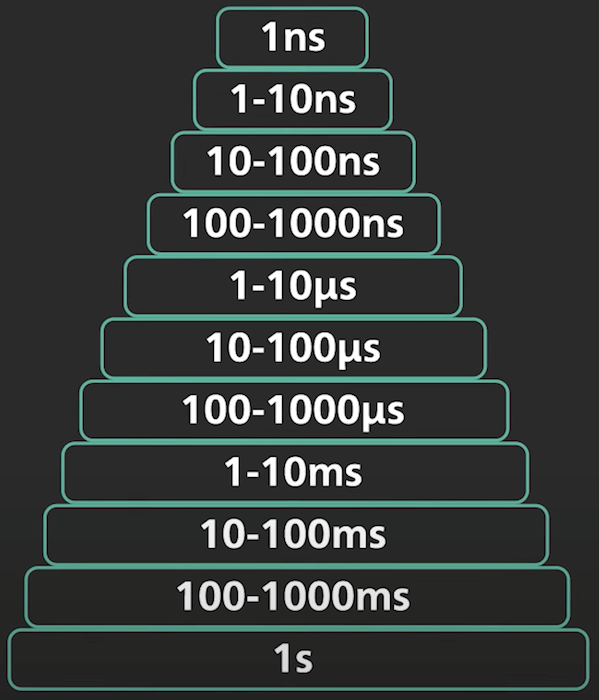
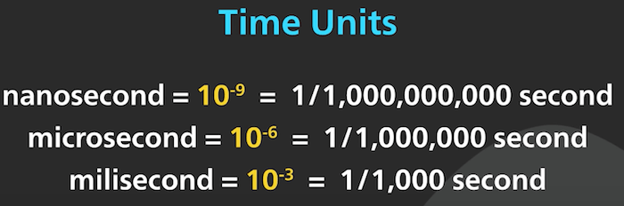
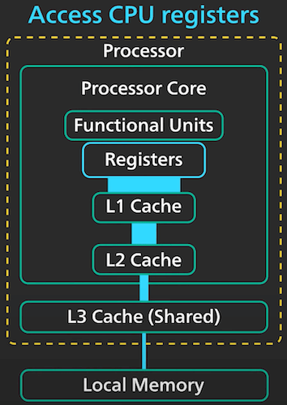
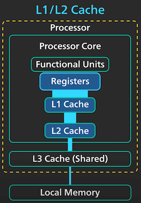
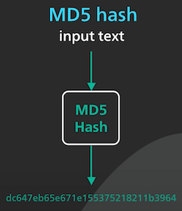
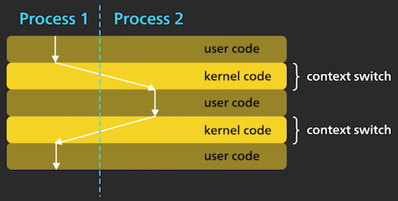
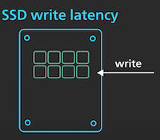
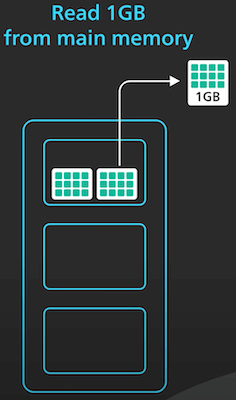
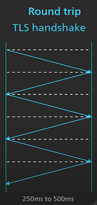

# Các mốc độ trễ mà lập trình viên nên biết

## Nguồn

 [Latency Numbers Programmer Should Know](https://www.youtube.com/watch?v=FqR5vESuKe0)

## Tại sao nên nói về độ trễ?

Độ trễ (latency) là một yếu tố quan trọng trong các hệ thống ngày nay. Thực sự chúng ta không cần biết độ trễ chính xác mà chỉ cần ghi nhớ một số khoảng độ trễ nhất định để hình dung ra thứ ta đang làm sẽ tốn khoảng trễ như thế nào.

Ta sẽ đi vào từng khoảng thời gian trễ để xem có những ứng dụng nào liên quan đến chúng hay không.

{ style="display: block; margin: 0 auto; height: 500px" }

{ style="display: block; margin: 0 auto; height: 200px" }

## 1 nano giây

Truy cập vào các thanh ghi CPU tốn khoảng dưới 1 nano giây. Ta chỉ có vài thanh ghi trong CPU nhưng truy cập chúng lại rất nhanh.

{ style="display: block; margin: 0 auto; height: 500px" }

Chu kỳ xung nhịp (clock cycle) của máy tính cũng tốn khoảng dưới 1 nano giây.

{ style="display: block; margin: 0 auto; height: 200px" }

## 1-10 nano giây

Truy cập vào bộ nhớ đệm (cache) L1 và L2 của CPU tốn từ 1 đến 10 nano giây. Một số thao tác tốn kém của CPU cũng ở trong khoảng này, ví dụ như branch mispredict penalty, tốn khoảng 20 chu kỳ xung nhịp.

{ style="display: block; margin: 0 auto; height: 500px" }

{ style="display: block; margin: 0 auto; height: 500px" }

## 10-100 nano giây

Truy cập vào bộ nhớ đệm L3 của CPU thường tốn khoảng 10 nano giây. 

{ style="display: block; margin: 0 auto; height: 500px" }

Với các bộ xử lý hiện đại như Apple M1, tham chiếu vào bộ nhớ chính tốn khoảng gần 100 nano giây. Nói cách khác, truy cập vào bộ nhớ chính của máy tính hiện đại sẽ chậm hơn vài trăm lần truy cập vào thanh ghi CPU.

## 100-1000 nano giây

Khoảng này sẽ gồm lệnh gọi hệ thống (system call). Trong Linux, gọi một lệnh hệ thống đơn giản sẽ tốn khoảng vài trăm nano giây. Lưu ý phần lớn thời gian trong này là chi phí để di chuyển vào kernel và đi ra, thời gian thực gọi lệnh hệ thống là rất ít.

{ style="display: block; margin: 0 auto; height: 500px" }

Ngoài ra, ta còn tốn khoảng 200 nano giây để MD5 hash một số 64 bit.

{ style="display: block; margin: 0 auto; height: 500px" }

## 1-10 micro giây

Context switch giữa các thread trong Linux tốn tầm khoảng vài micro giây. Dù vậy thì đây là trường hợp tốt nhất để có độ trễ này. Tuỳ vào workload, nếu context switch bao gồm việc mang các trang dữ liệu từ bộ nhớ cho luồng mới, nó có thể tốn nhiều thời gian hơn.

{ style="display: block; margin: 0 auto; height: 300px" }

Copy 64KB dữ liệu từ một chỗ trong bộ nhớ chính sang chỗ khác (cũng trong bộ nhớ chính) cũng tốn vài micro giây.

{ style="display: block; margin: 0 auto; height: 300px" }

## 10-100 micro giây

Network proxy như Nginx cần khoảng 50 micro giây để xử lý một HTTP request.

{ style="display: block; margin: 0 auto; height: 300px" }

Đọc 1MB liên tiếp từ bộ nhớ chính sẽ tốn khoảng 50 micro giây.

{ style="display: block; margin: 0 auto; height: 300px" }

Độ trễ đọc của ổ cứng SSD cũng trong khoảng này, tốn tầm 100 micro giây để đọc một trang 8K.

{ style="display: block; margin: 0 auto; height: 300px" }

## 100-1000 micro giây

Độ trễ ghi của ở cứng SSD lớn hơn tầm 10 lần so với độ trễ đọc, gần 1000 micro giây để ghi một trang.

{ style="display: block; margin: 0 auto; height: 300px" }

Thời gian trễ trọn vòng của mạng nội vùng (với các nền tảng đám mây hiện nay) là tầm khoảng vài trăm micro giây. Ngày nay độ trễ này có xu hướng giảm, đôi khi về dưới 100 micro giây.

{ style="display: block; margin: 0 auto; height: 300px" }

Một thao tác thông thường trên Memcache hay Redis tốn khoảng 1000 micro giây, bao gồm cả thời gian trễ trọn vòng ở trên.

{ style="display: block; margin: 0 auto; height: 300px" }

## 1-10 mili giây

Thời gian trễ trọn vòng của mạng xuyên vùng là vào khoảng 5 mili giây.

{ style="display: block; margin: 0 auto; height: 300px" }

Thời gian tìm (seek time) của ổ cứng cũng vào khoảng 5 mili giây.

{ style="display: block; margin: 0 auto; height: 300px" }

## 10-100 mili giây

Thời gian trễ trọn vòng của bờ đông và bờ tây nước Mỹ, hay bờ đông nước Mỹ và châu Âu nằm trong khoảng này.

{ style="display: block; margin: 0 auto; height: 300px" }

Đọc 1GB liên tiếp từ bộ nhớ chính cũng nằm trong khoảng này.

{ style="display: block; margin: 0 auto; height: 300px" }

## 100-1000 mili giây

Mất tầm 300 mili giây để bcrypt một mật khẩu.

{ style="display: block; margin: 0 auto; height: 300px" }

Bắt tay TLS nằm trong khoảng 250 đến 500 mili giây. Nó bao gồm nhiều network round trip nên con số sẽ tuỳ vào khoảng cách giữa 2 máy.

{ style="display: block; margin: 0 auto; height: 500px" }

Thời gian trễ trọn vòng với mạng từ bờ tây nước Mỹ đến Singapore cũng trong khoảng 100 đến 1000 mili giây.

{ style="display: block; margin: 0 auto; height: 300px" }

Đọc 1GB liên tiếp từ SSD cũng trong khoảng này.

## 1 giây

Chuyển 1GB trên mạng trong cùng một vùng đám mây tốn khoảng 10 giây.

{ style="display: block; margin: 0 auto; height: 300px" }
