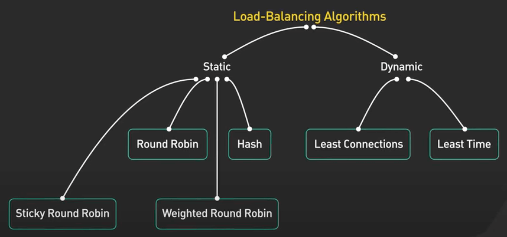
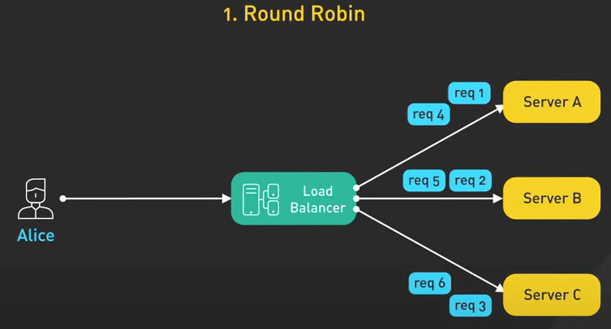
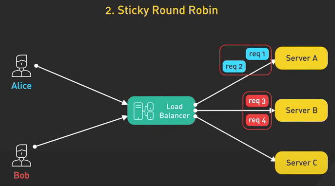
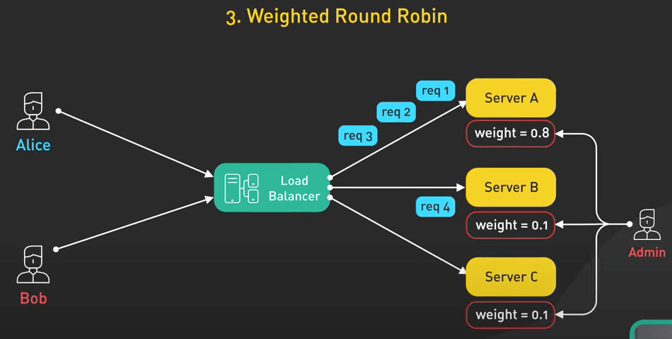
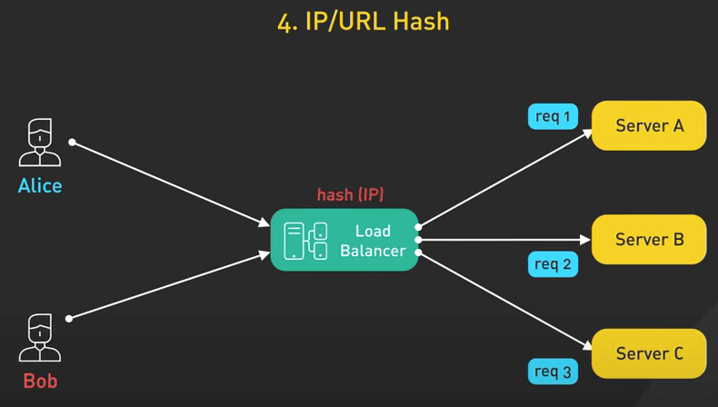
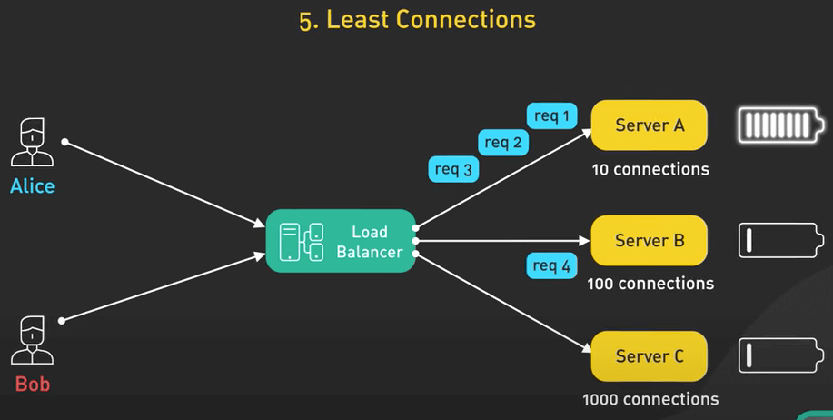

# 6 thuật toán load balancing phổ biến

## Nguồn

 [Top 6 Load Balancing Algorithms Every Developer Should Know](https://www.youtube.com/watch?v=dBmxNsS3BGE)

## Giới thiệu

Trong bài này, ta sẽ đi qua một số thuật toán load balancing (cân bằng tải). 

Bạn có bao giờ tự hỏi các nền tảng lớn hiện nay xử lý hàng triệu request mượt mà như thế nào chưa. Load balancing là một thành phần cực kỳ quan trọng của các ứng dụng quy mô lớn. Bằng cách phân phối công việc đều trên nhiều server, load balancing giúp tăng tính khả dụng (availability), khả năng phản hồi (responsiveness) và khả năng mở rộng (scalability).

Hiểu được các thuật toán load balancing phổ biến sẽ giúp ta thiết kế, tìm lỗi và tối ưu ứng dụng của ta tốt hơn.

Có hai loại thuật toán load balancing: **static load balancing** (tĩnh) và **dynamic load balancing** (động). Ta sẽ khái quát từng loại và đi vào mỗi thuật toán, xem chúng hoạt động như thế nào, ưu và nhược điểm của chúng là gì.

{ style="display: block; margin: 0 auto" }

## Static load balancing

Các thuật toán static load balancing phân phối các request đến các server mà không quan tâm đến trạng thái thời gian thực cũng như hiệu suất của server lúc đó.

Ưu điểm chính của các thuật toán static load balancing là sự đơn giản. Tuy nhiên nhược điểm của chúng là ít khả năng thích nghi và kém chuẩn xác.

### Round Robin

Round Robin (RR) về mặt lý thuyết được xem là thuật toán đơn giản nhất. Nó phân phối các request đến các server theo thứ tự. Nó sẽ gửi request 1 đến server A, request 2 đến server B và cứ thế theo thứ tự. Thuật toán này rất dễ cài và dễ hiểu.

{ style="display: block; margin: 0 auto" }

Tuy nhiên, bạn sẽ có khả năng sẽ làm quá tải các server nếu không theo dõi tình trạng của chúng.

### Sticky Round Robin

Sticky Round Robin là bản mở rộng của Round Robin. Nó gửi các request đến các server theo thứ tự như Round Robin, nhưng request từ cùng user sẽ được gửi đến cùng server. Mục tiêu ở đây là để cải thiện hiệu suất khi có các data liên quan ở cùng một server.

{ style="display: block; margin: 0 auto" }

Nhưng mất cân bằng tải sẽ xảy ra nếu một số user có nhiều request hơn các user khác.

### Weighted Round Robin

Weighted Round Robin là cho phép người vận hành gán trọng số (hay độ ưu tiên) cho mỗi server. Trọng số càng cao thì càng nhận được nhiều request. Cách này giúp ta giải quyết vấn đề khi có một số server mạnh hơn nhóm còn lại. Nhược điểm là trọng số cần phải được cài đặt bằng tay, khiến thuật toán này khong thích nghi được với các thay đổi.

{ style="display: block; margin: 0 auto" }

### Hash-based

Thuật toán dựa trên hash (hash-based) dùng một hàm hash để ánh xạ request đến server xử lý nó. Hàm này thường nhận vào địa chỉ IP của client hoặc URL được gọi để xác định hướng của request đến server nào. Nó có thể phân phối đều các request nếu hàm hash tốt. Tuy nhiên, tìm ra được hàm hash tối ưu khá là khó.

{ style="display: block; margin: 0 auto" }

## Dynamic load balancing

Các thuật toán dynamic load balancing phân phối các request dựa trên trạng thái thời gian thực và hiệu suất của các server.

### Least Connection

Thuật toán Least Connection (ít kết nối nhất) gửi mỗi request mới đến server có ít kết nối hoạt động nhất. Thuật toán này cần phải theo dõi số lượng kết nối hiện tại trên mỗi server. Điểm lợi là các request mới sẽ được gửi đến server có nhiều đất hoạt động nhất. Tuy nhiên, sẽ có khả năng sẽ có quá nhiều reuqest đến một server nếu các kết nối rải ra không đều.

{ style="display: block; margin: 0 auto" }

### Least Response Time

Thuật toán Least Response Time (thời gian trả về ít nhất) gửi request đến server có thời gian trả về ít nhất hiện tại (nhanh nhất). Độ trễ của mỗi server được tính toán liên tục. Thuật toán này có khả năng thích nghi và phản ứng cao. Tuy nhiên nó cần được theo dõi nhiều bởi người quản trị, khiến nó khả phức tạp để vận hành. Nó cũng không quan tâm đến việc có bao nhiêu request đang được xử lý trên mỗi server.

{ style="display: block; margin: 0 auto" }

## Tổng kết

Rõ ràng là ta thấy mỗi loại thuật toán đều có ưu nhược điểm riêng. Ta cần cân nhắc về hiệu suất, khả năng server và các giới hạn trước khi chọn thuật toán load balancing phù hợp cho ứng dụng của ta.

Thuật toán Round Robin hoạt động tốt trên các ứng dụng đơn giản. Còn các thuật toán dynamic load balancing giúp tối ưu thời gian trả về và tính khả dụng cho các ứng dụng lớn và phức tạp.