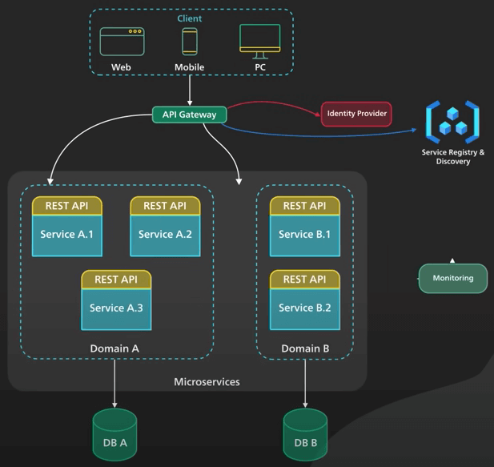
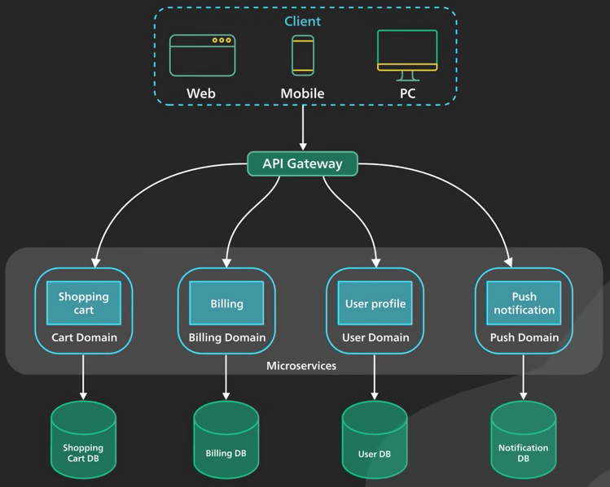
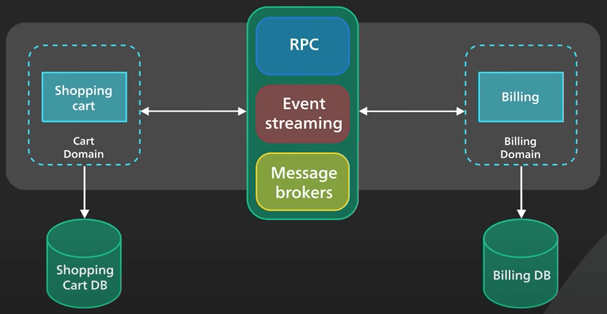
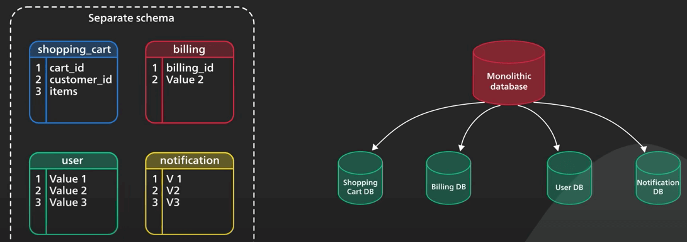
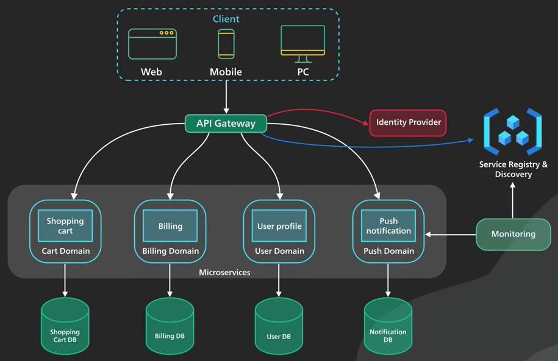
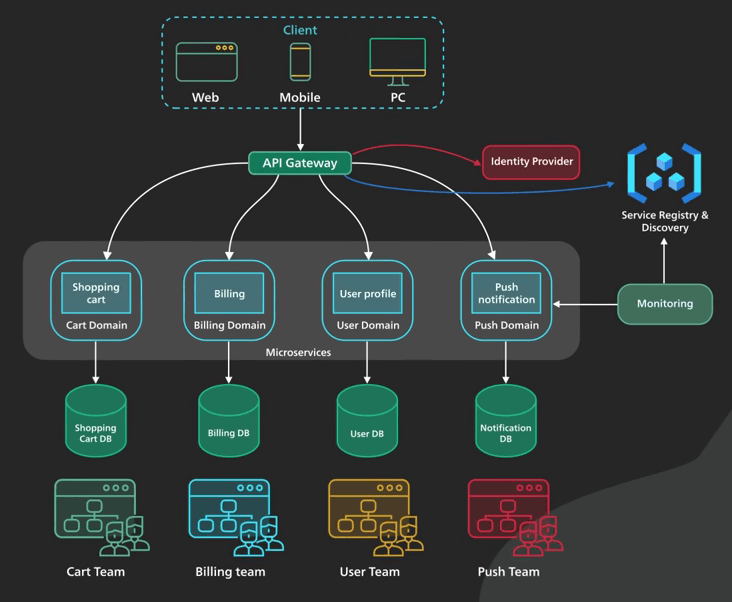

# Microservices là gì?

## Nguồn

 [What Are Microservices Really All About? (And When Not To Use It)](https://www.youtube.com/watch?v=lTAcCNbJ7KE)

## Giới thiệu về kiến trúc microservice

Kiến trúc **microservice** (dịch vụ siêu nhỏ) cho phép các team lớn xây dựng các ứng dụng có thể mở rộng bao gồm nhiều service được liên kết với nhau. 

{ style="display: block; margin: 0 auto" }

Các microservice được liên kết lỏng lẻo với nhau. Mỗi service xử lý một chức năng chuyên dụng trong một ứng dụng quy mô lớn. Ví dụ, giỏ hàng, thanh toán, hồ sơ người dùng và push notification đều có thể trở thành các microservice riêng lẻ. Các khu vực chức năng đôi khi được gọi là các **miền** (domains). 

{ style="display: block; margin: 0 auto" }

Các microservice giao tiếp với nhau thông qua các interface được xác định rõ ràng với tầm ảnh hưởng (surface area) nhỏ. Tầm ảnh hưởng nhỏ này hạn chế ảnh hưởng của lỗi và các hỏng hóc về sau. Nó giúp mỗi service dễ dàng suy ra bối cảnh của toàn bộ ứng dụng. Các microservice giao tiếp thông qua một tập các lời gọi thủ tục từ xa (RPC - Remote Procedure Call), truyền phát sự kiện (event streaming) hoặc trình phân phối tin nhắn (message broker). 

{ style="display: block; margin: 0 auto" }

RPC như gRPC cung cấp response nhanh hơn, nhưng tầm ảnh hưởng đến các microservice khác sẽ lớn hơn khi service bị ngưng hoạt động. Event streaming cung cấp sự cách ly tốt hơn giữa các service nhưng mất nhiều thời gian hơn để xử lý.

Các microservice có thể được triển khai độc lập với nhau. Vì mỗi service nhỏ, dễ suy luận hơn và có tầm ảnh hưởng nhỏ, điều này giúp người vận hành yên tâm và tự tin triển khai thường xuyên. Các Microservice mang lại sự linh hoạt hơn để mở rộng quy mô của từng microservice một cách độc lập. Sự linh hoạt trong hoạt động là vô giá. Các microservice có kiến trúc tốt thực hiện ẩn thông tin rất hiệu quả. Điều này có nghĩa là việc chia database nguyên khối thành các thành phần logic khác nhau và giữ từng thành phần ẩn kỹ bên trong microservice tương ứng của nó. Nói về thành phần logic, nó có thể có nghĩa là một schema riêng trong cụm database hoặc một database vật lý hoàn toàn riêng biệt, tuỳ vào cài đặt.

{ style="display: block; margin: 0 auto" }

Tuy nhiên, một nhược điểm lớn của microservice là việc chia nhỏ database. Với việc chia database thành các đơn vị logic riêng biệt, database không còn có thể duy trì các quan hệ khoá ngoại và thực thi tính toàn vẹn tham chiếu giữa các đơn vị này. Gánh nặng duy trì tính toàn vẹn dữ liệu được chuyển sang tầng ứng dụng.

## Các thành phần khác

Ta cùng xem xét các thành phần quan trọng khác để triển khai thành công kiến trúc microservice. Thứ nhất là API gateway. API gateway xử lý các request đến và định tuyến chúng đến các microservice có liên quan. API gateway dựa vào service của nhà cung cấp danh tính để xử lý xác thực và cấp quyền cho từng request đến thông qua API gateway. 

Để biết được service để định tuyến một request, API gateway sẽ tham khảo service registry và discovery service. Các microservice đăng ký với service registry và tìm hiểu thông tin của các microservice khác thông qua discovery service. Ngoài ra còn có các thành phần hữu ích khác trong kiến trúc microservice như giám sát và cảnh báo, công cụ DevOps để triển khai và khắc phục sự cố.

{ style="display: block; margin: 0 auto" }

## Khi nào cần dùng?

Như vậy khi nào cần dùng kiến trúc microservice? 

Xây dựng và vận hành kiến trúc microservice khá tốn kém. Nó chỉ thực sự có ý nghĩa với các team lớn. Mỗi miền, hoặc chức năng có thể được duy trì độc lập bởi một team chuyên dụng. Trong một kiến trúc microservice được thiết kế tốt, các team độc lập này có thể tự vận hành nhanh, và tầm ảnh hưởng của lỗi sẽ được kiểm soát tốt. Mỗi service có thể được thiết kế, triển khai, và mở rộng một cách độc lập. 

{ style="display: block; margin: 0 auto" }

Tuy nhiên, chi phí của của việc triển khai như vậy rất lớn nên nó thưởng không phù hợp với các startup nhỏ. Một lời khuyên cho các startup nhỏ là nên thiết kế mỗi chức năng trong ứng dụng với interface rõ ràng. Một ngày nào đó, nếu business và team phát triển nhanh và kiến trúc microservice bắt đầu có ý nghĩa, thì việc chuyển đổi sẽ dễ quản lý hơn.
