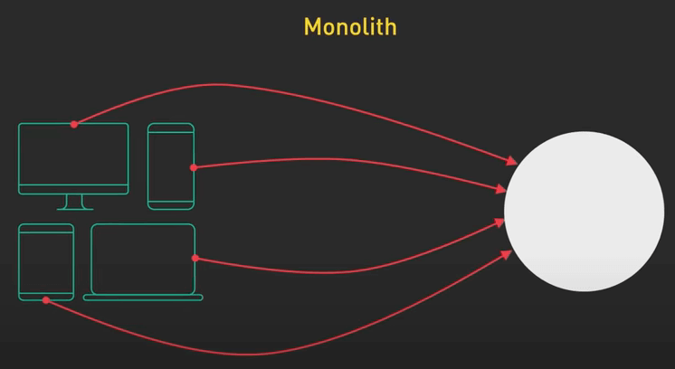
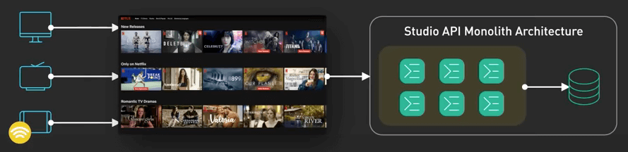
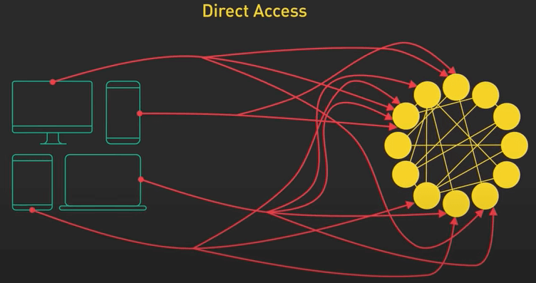
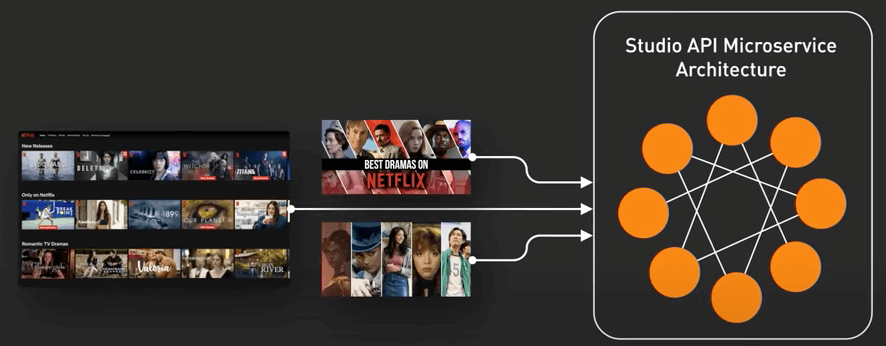
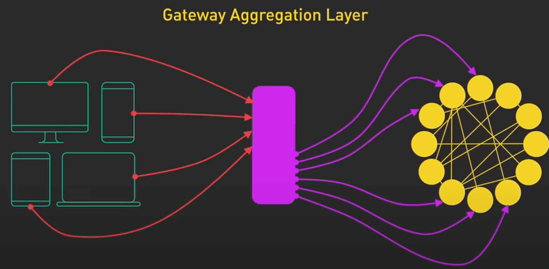
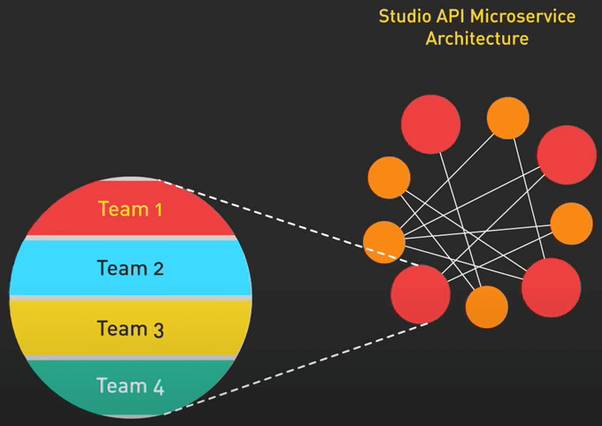
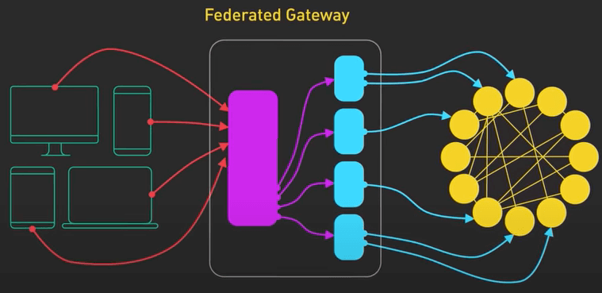

# Giải mã sự phát triển trong kiến trúc API của Netflix

## Nguồn

 [Demystifying the Unusual Evolution of the Netflix API Architecture](https://www.youtube.com/watch?v=Uu32ggF-DWg)

Trong những ngày đầu, Netflix sử dụng kiến trúc nguyên khối (monolith). Hình dung một hệ thống lớn, kết nối vớii nhau, trong đó tất cả các thành phần là một phần của một codebase thống nhất.

{ style="display: block; margin: 0 auto" }

{ style="display: block; margin: 0 auto" }

Khi Netflix phát triển và hợp tác với nhiều studio hơn để tạo ra nhiều nội dung gốc, kiến trúc nguyên khối này bắt đầu trở thành một vấn đề. Các kỹ sư của Netflixx đã chuyển đổi kiến trúc này trở thành các microservice. Netflix được biết đến với số lượng microservice đồ sộ. Sự thay đổi này giúp tăng hiệu quả và khả năng tự chủ. Nó biến kiến trúc của Netflix thành một mạng lưới các service.

{ style="display: block; margin: 0 auto" }

{ style="display: block; margin: 0 auto" }

Nhưng việc kết nối trực tiếp các ứng dụng mà các studio sử dụng với nhiều microservice không phải là điều lý tưởng. Để vượt qua thách thức này, họ đã tạo ra một layer tổng hợp cổng dịch vụ. Về cơ bản, họ xây dựng ra một API Gateway để liên kết tất cả các service với nhau và giới thiệu một giao diện thống nhất cho client. 

{ style="display: block; margin: 0 auto" }

Thiết lập này hoạt động tốt trong các trường hợp sử dụng nhiều service cùng lúc. Giả sử ta có một studio app cần dùng 3 API: movie, production và talent, để render UI cho frontend. Layer tổng hợp cổng dịch vụ sẽ giải quyết chuyện này.

Layer tổng hợp cổng dịch vụ quản lý các API một cách có trật tự, theo lý thuyết là thế, nhưng thực tế nó lại trở thành một kiến trúc nguyên khối mới khi team mở rộng và có nhiều service hơn. Khi số dev tăng lên và độ phức tạp của các domain tăng lên, việc dev layer này trở nên khó hơn. 

{ style="display: block; margin: 0 auto" }

Để giải quyết vấn đề này, Netflix chuyển sang GraphQL và giởi thiệu Federated Gateway (cổng liên kết). Chiến lược này cho phép các dev quản lý phần của họ trong "graph", đồng thời cung cấp một điểm truy cập thống nhất và hiệu quả cho các studio app khác nhau.

{ style="display: block; margin: 0 auto" }

GraphQL là trái tim của Federated Gateway. Ngôn ngữ truy vấn mạnh mẽ này cho phép UI truy vấn chính xác những gì nó cần trong một round-trip, kể cả khi người dùng ở xa datacenter. Nhờ có GraphQL và Federated Gateway, Netflix có thể định tuyến business logic phức tạp đến các dịch vụ thích hợp. Liên kết GraphQL cho phép Netflix thiết lập một cổng GraphQL duy nhất để truy vấn dữ liệu từ tất cả các API khác. 

Hành trình từ kiến trúc nguyên khối đến Federated Gateway minh họa cách kiến trúc hệ thống cần thích ứng với nhu cầu kinh doanh năng động và ngày càng tăng. Chính những điều chỉnh này đã giúp Netflix tạo ra các nội dung mà chúng ta yêu thích. Nhưng đây là điểm chính. Sự phát triển của kiến trúc là tối quan trọng. Thật dễ dàng để nhìn vào những gã khổng lồ như Google và Netflix và sao chép cơ sở hạ tầng của họ, ngay cả khi điều đó không cần thiết. Tối ưu hóa quá mức cho những vấn đề mà bạn không gặp, và có thể không bao giờ gặp, là một cạm bẫy phổ biến. Thay vào đó, ta cần tập trung vào những nhu cầu của mình. Chúng ta nên quyết định logic kinh doanh của mình nên tập trung vào đâu và xác định nơi ta cần để mở rộng quy mô khi doanh nghiệp của ta phát triển. 

Kiến trúc doanh nghiệp của chúng ta phải được điều chỉnh theo nhu cầu của nó chứ không phải ngược lại. Kiến trúc tốt nhất là kiến trúc phù hợp với nhu cầu kinh doanh của chúng ta, không phải là kiến trúc bắt chước những gã khổng lồ công nghệ.
