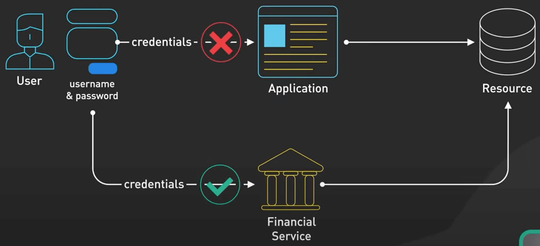
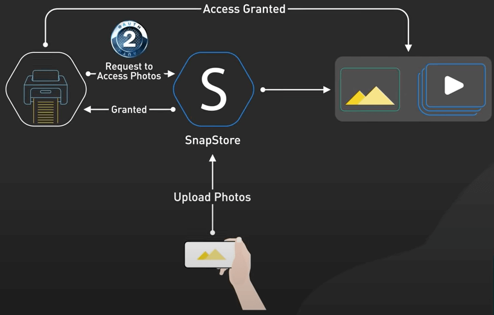
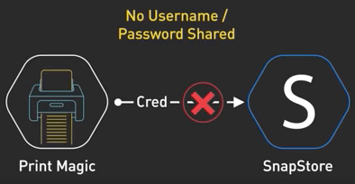
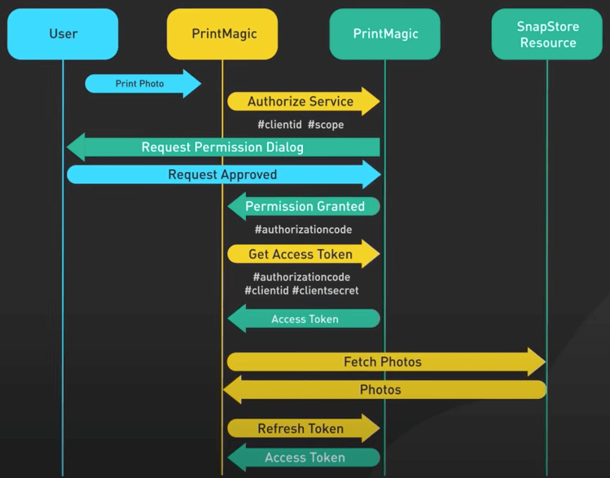

# Giải thích dễ hiểu OAuth2

## Nguồn

 [OAuth 2 Explained In Simple Terms](https://www.youtube.com/watch?v=ZV5yTm4pT8g)

## Thuở sơ khai

Ta cùng nhau nhớ lại thời kỳ sơ khai của Internet, việc chia sẻ thông tin lúc đó khá là chân phương. Bạn chỉ cần đưa service tên đăng nhập và mật khẩu của bạn và cái service đó có thể truy cập vào bất cứ thứ gì nó muốn. Cách làm này khá là khó chịu, tuy nhiên vẫn có một số chỗ vẫn còn sử dụng, như trong một số phần mềm tài chính cá nhân để lấy thông tin từ một số ngân hàng cũ nào đó.

{ style="display: block; margin: 0 auto" }

May mắn là ta có thứ khác ngon hơn, đó là **OAuth2**.

## OAuth2 là cái gì?

OAuth2 sẽ kiểu như bạn đưa cho ai đó một cái key đặc biệt, key này cho phép người đó truy cập vào một số phần thông tin nhất định của ta trong một ứng dụng khác. Ta sẽ kiểm soát được ai có quyền truy cập thông tin của mình mà không phải chia sẻ mật khẩu. Và điều tuyệt vời nữa là ta có thể thu hồi cái key đó bất kỳ lúc nào.

{ style="display: block; margin: 0 auto" }

## Ví dụ

Xét một ví dụ như sau: Ta có một ứng dụng lưu trữ ảnh tên là SnapStore. Ta đang dùng nó để lưu trữ hình ảnh, và giờ ta muốn in một số hình với một service in của bên thứ ba, gọi là PrintMagic.

Thay vì phải upload bằng tay mỗi tấm hình lên PrintMagic, ta có thể yêu cầu PrintMagic làm điều đó luôn. Với chỉ một cú click chuột, ta trao (grant) cho PrintMagic quyền để truy cập vào các hình ảnh của ta trên SnapStore.

{ style="display: block; margin: 0 auto" }

Với OAuth2, PrintMagic sẽ thay mặt ta truy cập vào kho hình trên SnapStore mà không cần biết thông tin đăng nhập của chúng ta.

{ style="display: block; margin: 0 auto" }

Đây là một ví dụ về luồng OAuth, được dẫn đầu bởi OAuth2. Hãy cùng đi sâu hơn chút nhé.

Trong hoàn cảnh này, ta là **resource owner** (chủ tài nguyên), vì ta chính là chủ của những tấm hình của chính mình trên SnapStore. SnapStore là **resource server** (máy chủ tài nguyên), là thứ đang lưu hình ảnh. PrintMagic là **client** muốn truy cập vào kho hình. **Authorization server** (máy chủ định danh) có thể là một phần của SnapStore hoặc có thể từ một **identity provider** (nhà cung cấp danh tính) bên ngoài nào đó, nó chịu trách nhiệm xử lý quá trình OAuth2.

Ta đi vào xem luồng OAuth2 cụ thể sẽ đi như thế nào nhé.

1. Mọi chuyện bắt đầu khi ta hướng dẫn PrintMagic lấy hình từ SnapStore.
2. PrintMagic gửi một client ID và scope (phạm vi truy cập) đến authorization server của SnapStore. 
3. Là một resource owner, ta xác thực danh tính trực tiếp với SnapStore và đồng ý trao cho PrintMagic quyền để truy cập hình ảnh của mình. 
4. Khi được sự đồng ý, authorization server gửi một authorization code về cho PrintMagic. 
5. PrintMagic sẽ lại mang authorization code này, cùng với client ID và client secret đến cho authorization server. Client secret là một khoá bí mật được chỉ được chia sẻ cho PrintMagic và authorization server. 
6. Nếu authorization server xác nhận authorization code, client ID và client secret, nó sẽ tạo ra một **access token** gửi về PrintMagic. 
7. PrintMagic sẽ dùng cái token này để request hình ảnh từ resource server của SnapStore.

OAuth2 đảm bảo rằng thông tin đăng nhập của SnapStore sẽ không bao giờ được lộ ra cho bên PrintMagic biết, và vẫn cho PrintMagic truy cập thông tin, nhưng chỉ những thông tin được trao quyền truy cập. Thêm một vấn đề nữa cần lưu ý là access token có thể hết hạn sau một khoảng thời gian hoặc có thể bị ta thu hồi bất cứ lúc nào, đây là một lớp bảo mật rất đáng giá.

OAuth2 còn hỗ trợ **refresh token**, nó có thể được dùng để lấy access token mới khi cái cũ hết hạn mà không cần ta phải làm gì cả.

{ style="display: block; margin: 0 auto" }
