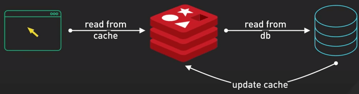
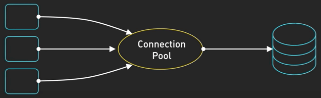
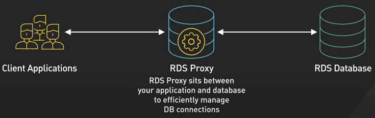
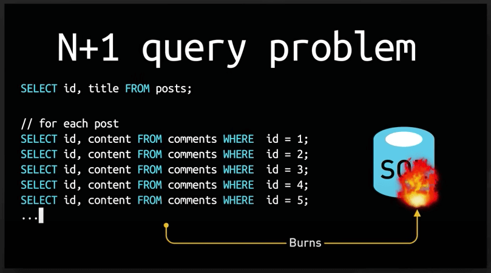
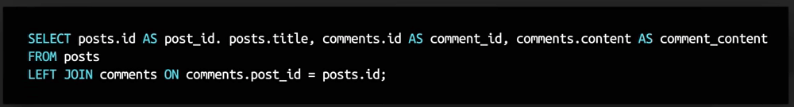
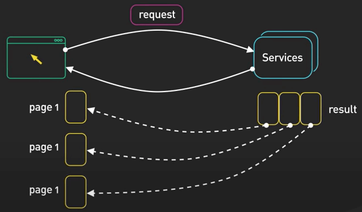
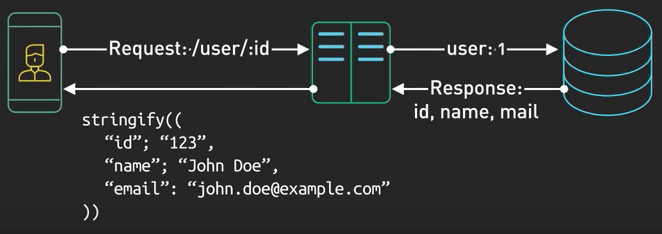
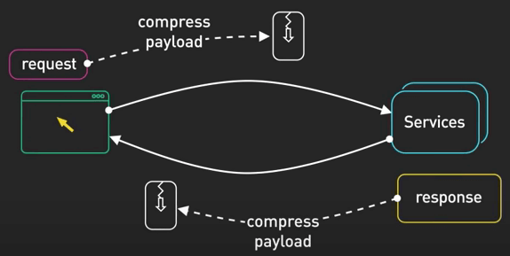
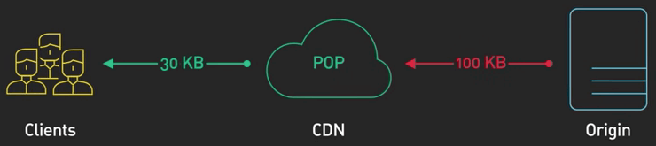
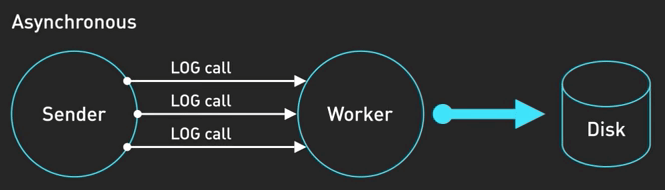

# 7 cách để tăng hiệu suất API của bạn

## Nguồn

 [Top 7 Ways to 10x Your API Performance](https://www.youtube.com/watch?v=zvWKqUiovAM)

## Lời tựa

Bạn có thấy mệt mỏi vì mấy cái API chậm chạp làm cho ứng dụng của bạn như rùa bò không? Bạn đến đúng chỗ rồi đấy. Trong bài viết này, chúng ta sẽ tìm hiểu 7 kỹ thuật để tối ưu hiệu suất API của bạn.

Trước khi bắt đầu, có một điều quan trọng cần lưu ý. Tối ưu không nên là bước đầu trong quá trình của bạn. Tối ưu mạnh mẽ thật đấy nhưng nó có thể làm API của bạn phức tạp hơn mức cần thiết nếu làm không cẩn thận. Bước đầu tiên luôn là phải xác định chỗ nào làm chậm API, thông qua load test và profiling request. Chỉ bắt đầu tối ưu khi bạn chắc chắn rằng cái API đó có vấn đề về hiệu suất.

Giờ ta cùng bắt đầu nhé.

## Caching

Caching là một trong những cách hiệu quả nhất để tăng tốc API. Với caching, ta sẽ lưu kết quả của một quá trình tính toán tốn kém nào đó vào cache để lấy thẳng nó ra trong những request tiếp theo mà không cần phải tính lại.

{ style="display: block; margin: 0 auto" }

Nếu bạn có một API endpoint thường xuyên được gọi với cùng tham số, bạn có thể tránh việc gọi database nhiều lần bằng cách cache response vào Redis hay Memcached. Phần lớn các thư viện cache làm cho mọi việc trở nên dễ dàng hơn cho chúng ta bằng cách thêm vài dòng code. Cache trong một khoảng thời gian ngắn cũng tạo ra sự khác biệt cực lớn về tốc độ đấy.

## Connection pooling

Tiếp theo là connection pooling. Kỹ thuật này cần ta phải duy trì một bể (pool) các kết nối (connection) mở, để tránh việc mở một connection mới đến database trong mỗi lần gọi API.

{ style="display: block; margin: 0 auto" }

Việc tạo một connection mới mỗi lần gọi API như vậy bao gồm rất nhiều lần bắt tay (handshake) và setup, khiến API của bạn chậm đi. Việc sử dụng lại connection sẽ cải thiện thông lượng rất nhiều.

Nếu bạn sử dụng kiến trúc Serverless (như IBM OpenWhisk, API Gateway, AWS Lambda, Google Cloud Functions hay Microsoft Azure Functions), việc quản lý connection sẽ khó hơn một chút, bởi vì mỗi thằng serverless function thường mở database connection riêng và vì serverless có thể tăng quy mô nhanh chóng, nó có khả năng dẫn đến một số lượng lớn connection mở, gây nên quá tải database. Các giải pháp như AWS RDS Proxy và SQL database serverless của Azure được thiết kế để xử lý vấn đề này và quán lý connection pooling cho bạn.

{ style="display: block; margin: 0 auto" }

## Truy vấn N+1

Thêm một tip nữa cho việc cải thiện hiệu suất database, đó là việc tránh Truy vấn N+1.

Ví dụ, bạn đang tạo một API endpoint để lấy các blog post và các comment trong mỗi post. Vấn đề này sẽ xảy ra khi bạn truy vấn lần đầu để lấy các post, và với mỗi post, bạn truy vấn một lần để lấy các comment. Giờ nếu bạn có N post như thế, việc này sẽ tạo ra 1 truy vấn để lấy các post, cộng với N truy vấn cho các comment. Đây là lý do có cái tên Truy vấn N+1.

{ style="display: block; margin: 0 auto" }

Để tránh vấn đề này, sẽ tốt hơn nếu bạn lấy data trong một truy vấn duy nhất hoặc 2 truy vấn trong một số trường hợp khác, một để lấy các post, và một để lấy tất cả comment trong các post đó. Giải pháp này giúp tránh việc truy vấn quá nhiều và giảm round trip giữa server và database, từ đó cải thiện hiệu suất.

{ style="display: block; margin: 0 auto" }

## Phân trang

Dùng phân trang (pagination) khi cần.

Nếu API của bạn trả về một lượng lớn data, nó có thể làm chậm ứng dụng. Thay vào đó, chia response thành nhiều trang nhỏ hơn với các tham số `limit` và `offset`. Điều này sẽ giúp tăng tốc độ truyền tải dữ liệu và tránh việc client bị chậm vì phải xử lý quá nhiều data một lúc. 

{ style="display: block; margin: 0 auto" }

## Sử dụng thư viện JSON serialization nhẹ

Khi trả về JSON response từ API, tốc độ của quá trình serialization có thể tạo nên ảnh hưởng rất lớn đến thời gian trả về dữ liệu. Hãy cân nhất dùng một thư viện serialization nhanh để tối thiểu hoá thời gian dành cho việc chuyển đổi dữ liệu của bạn thành dạng JSON.

{ style="display: block; margin: 0 auto" }

## Nén dữ liệu

Khi nén dữ liệu cho các response lớn, bạn có thể giảm dung lượng chuyển dữ liệu trên mạng. Client sau đó sẽ giải nén data này.

{ style="display: block; margin: 0 auto" }

Ngày nay, có rất nhiều thuật toán hiệu quả như Brotli cho phép nén dữ liệu tốt hơn. Các CDN như Cloudflare cũng có thể nén dữ liệu cho bạn, giúp giải phóng việc nén khỏi server.

{ style="display: block; margin: 0 auto" }

## Logging bất đồng bộ

Trong nhiều ứng dụng, thời gian cần để viết log thường không đáng kể. 

{ style="display: block; margin: 0 auto" }

Tuy nhiên, trong nhiều hệ thống thông lượng cao, mỗi một mili giây đều quý giá. Thời gian cần để viết log có thể khá lớn. Logging bất đồng bộ có thể giải quyết điều này. Trong logging bất đồng bộ, thread chính sẽ nhanh chóng đặt log entry vào một buffer in-memory trong khi một thread logging riêng biệt sẽ viết log vào file hoặc gửi chúng thông qua logging service. Nên nhớ rằng trong logging bất đồng bộ, bạn sẽ có khả năng nhỏ có thể mất vài log nếu ứng dụng bị crash trước khi log được ghi ra.

{ style="display: block; margin: 0 auto" }
