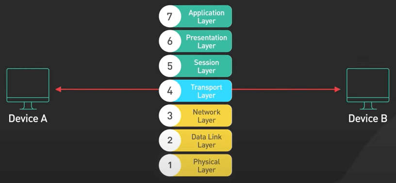
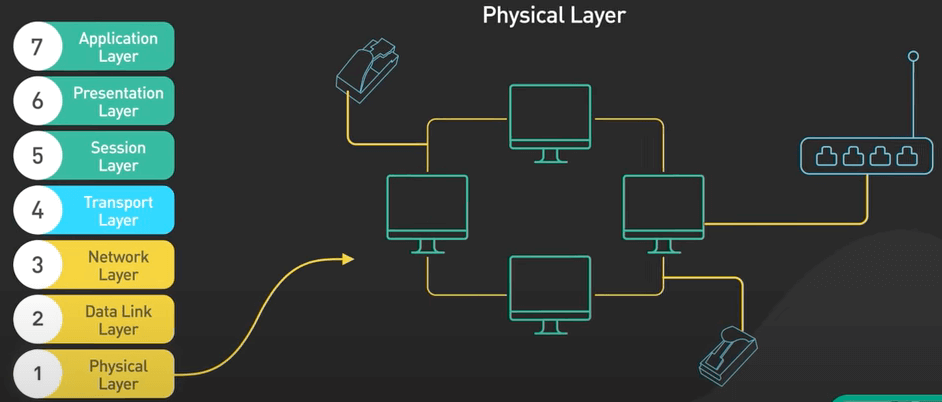
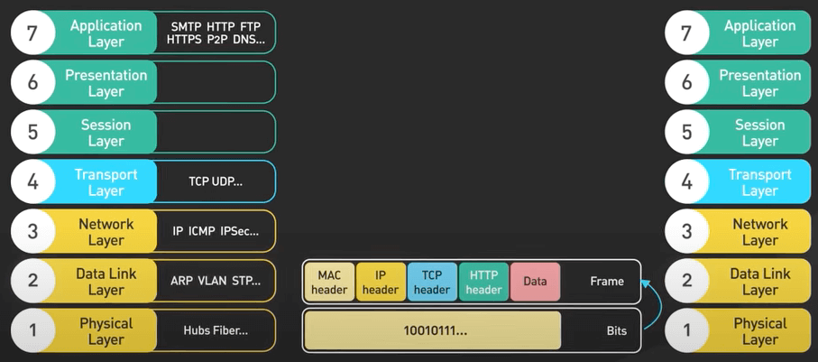
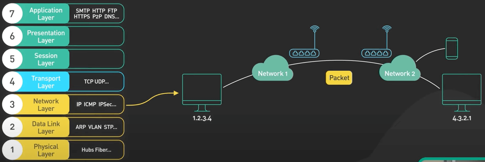
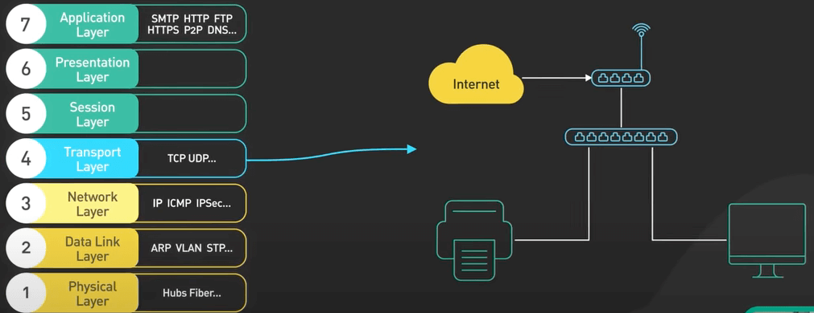
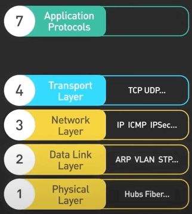
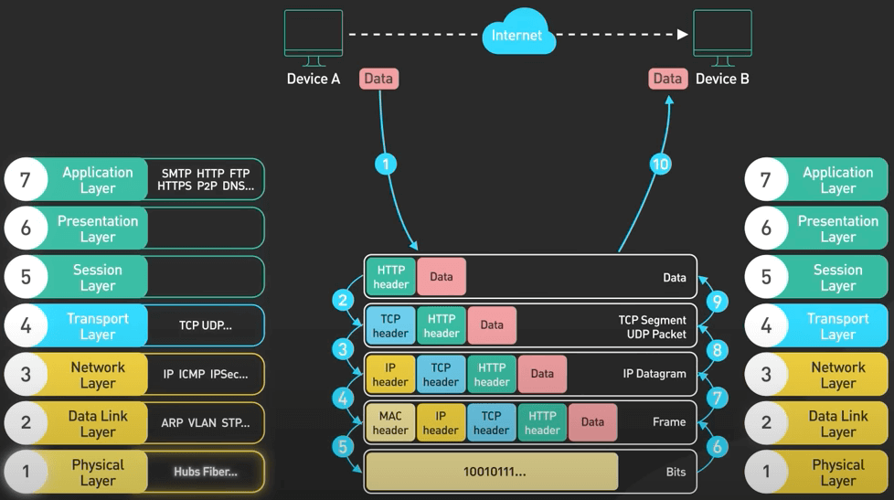
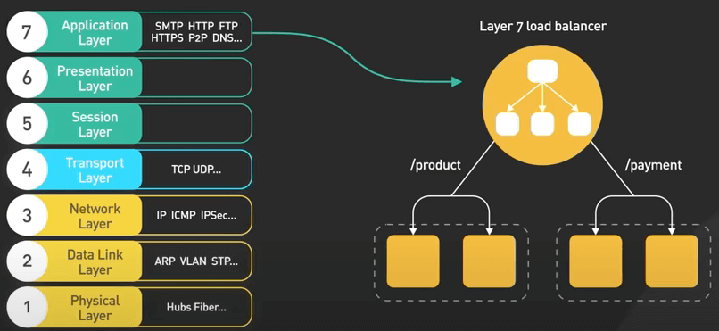
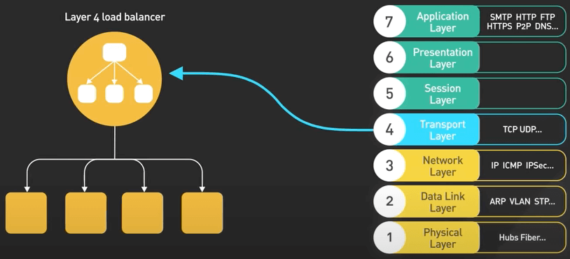

# Mô hình OSI là gì?

## Nguồn

 [What is OSI Model | Real World Examples](https://www.youtube.com/watch?v=0y6FtKsg6J4)

## Khái niệm

**Mô hình OSI (Open Systems Interconnect)** là một framework (về mặt lý thuyết) cung cấp một góc nhìn về mạng. Nó chia việc giao tiếp giữa hai thiết bị trên mạng vào 7 tầng trừu tượng.

{ style="display: block; margin: 0 auto" }

**Tầng vật lý (Physical Layer)** là tầng dưới cùng. Nó chịu trách nhiệm truyền tải các bit dữ liệu thô qua một kết nối vật lý.

{ style="display: block; margin: 0 auto" }

**Tầng liên kết dữ liệu (Data Link Layer)** là tầng thứ hai. Nó lấy các bit dữ liệu thô từ tầng vật lý và tổ chức chúng thành các frame. Nó đảm bảo các frame được đưa đến đúng địa chỉ. Ethernet hầu hết là nằm trong tầng này.

{ style="display: block; margin: 0 auto" }

**Tầng mạng (Network Layer)** là tầng thứ ba. Nó chịu trách nhiệm định tuyến các frame dữ liệu trên các mạng khác nhau. Phần IP của TCP/IP là một ví dụ nổi tiếng về tầng này.

{ style="display: block; margin: 0 auto" }

**Tầng giao vận (Transport Layer)** là tầng thứ tư. Nó xử lý giao tiếp đầu cuối giữa 2 node. Đây là nơi chứa TCP và UDP. 

{ style="display: block; margin: 0 auto" }

TCP cung cấp khả năng liên lạc đầu cuối, đáng tin cậy giữa các thiết bị. Nó thực hiện điều này bằng cách chia dữ liệu thành các phân đoạn nhỏ, có thể quản lý được và gửi từng phân đoạn riêng lẻ. Mỗi đoạn có một số thứ tự gắn liền với nó. Đầu nhận sử dụng các số thứ tự để tập hợp lại dữ liệu theo đúng thứ tự. TCP cũng cung cấp chức năng kiểm tra lỗi để đảm bảo rằng dữ liệu không bị hỏng trong quá trình truyền.

{ style="display: block; margin: 0 auto" }

UDP cũng là một giao thức nổi tiếng trong tầng giao vận. Nó tương tự như TCP nhưng đơn giản hơn và nhanh hơn. UDP không cung cấp tính năng kiểm tra lỗi và kiểm tra độ tin cậy, khác với TCP. Nó chỉ đơn giản là gửi các gói tin từ thiết bị này sang thiết bị khác. Đầu nhận có trách nhiệm xác định xem gói tin có được nhận chính xác hay chưa. Nếu có lỗi xảy ra, đầu nhận chỉ đơn giản là loại bỏ gói tin.

{ style="display: block; margin: 0 auto" }

Các tầng còn lại bao gồm **tầng phiên (Session Layer), tầng trình diễn (Presentation Layer) và tầng ứng dụng (Application Layers)**. Đây là nơi mà mô hình OSI mất đi tính hữu dụng trong thực tế. Chúng quá chi tiết và không phản ánh thực tế. Nói chung, **chỉ cần thu gọn chúng thành một tầng duy nhất và coi các giao thức ứng dụng (Application Protocols Layer) như HTTP như các giao thức tầng 7 là được.**

{ style="display: block; margin: 0 auto" }

## Dữ liệu đi qua mô hình OSI như thế nào.

Ta cùng xem xét mọt ví dụ về cách dữ liệu di chuyển qua các tầng khi được truyền qua mạng.

(1) Người dùng gửi một HTTP request đến web server qua mạng, HTTP header được thêm vào dữ liệu ở tầng ứng dụng. 

(2) Sau đó, một TCP header được thêm vào dữ liệu. Nó được gói gọn trong các đoạn TCP ở tầng giao vận. Header chứa port nguồn, port đích và số thứ tự.

(3) Tiếp theo, các phân đoạn được gói với một IP header ở tầng mạng. IP header chứa địa chỉ IP nguồn và đích. 

(4) Một MAC header được thêm vào tầng liên kết dữ liệu, với địa chỉ MAC nguồn và đích. Thực ra địa chỉ MAC thường không phải là địa chỉ MAC của thiết bị gửi và thiết bị nhận. Chúng là địa chỉ MAC của các thiết bị định tuyến trong bước nhảy tiếp theo của hành trình dài trên internet. 

(5) Các frame cũng được gửi qua mạng ở dạng bit dữ liệu thô trong tầng vật lý. 

(6) + (7) + (8) + (9) + (10) Khi web server nhận được các bit thô này từ mạng, nó sẽ đảo ngược quy trình. Các header được bóc ra trên từng tầng, và cuối cùng, web server xử lý HTTP request.

{ style="display: block; margin: 0 auto" }

Tóm lại, mô hình OSI là một cách nhìn về cách mạng hoạt động. Mục đích chính của nó là để giáo dục. Mặc dù các tầng không hoàn toàn phù hợp với các use case trong thế giới thực, chúng vẫn được các nhà cung cấp mạng và nhà cung cấp dịch vụ đám mây sử dụng rộng rãi như một cách để mô tả bị trí của các sản phẩm mạng của họ trong mô hình OSI.

Ví dụ: load balancer trên đám mây thường được chia làm hai loại - L4 và L7.

L7 load balancer nghĩa là nó hoạt động ở tầng giao thức ứng dụng như HTTP và HTTPS. 

{ style="display: block; margin: 0 auto" }

L4 load balancer thì hoạt động ở tầng giao vận.

{ style="display: block; margin: 0 auto" }
