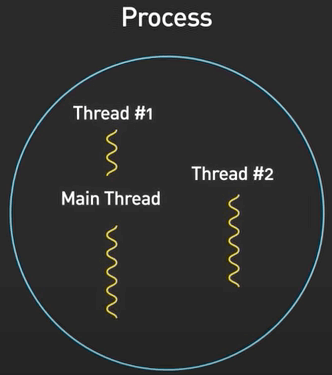
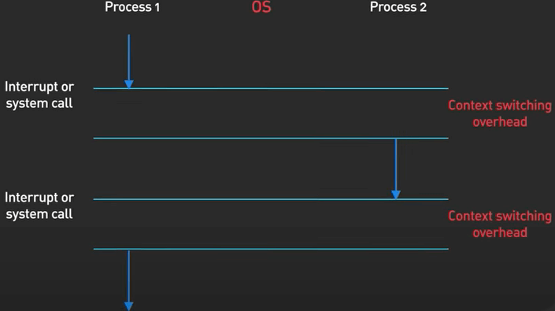
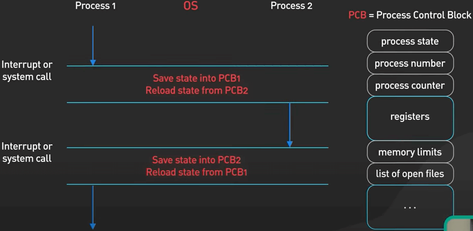
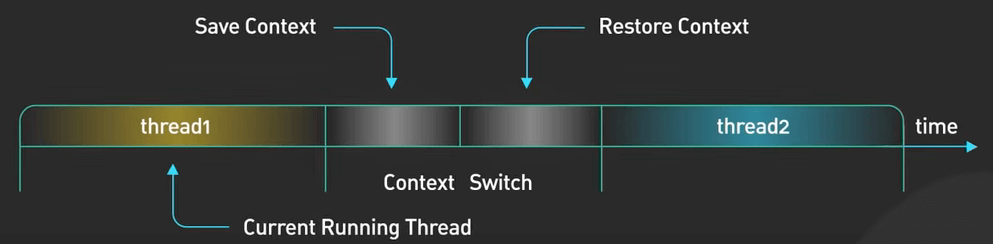
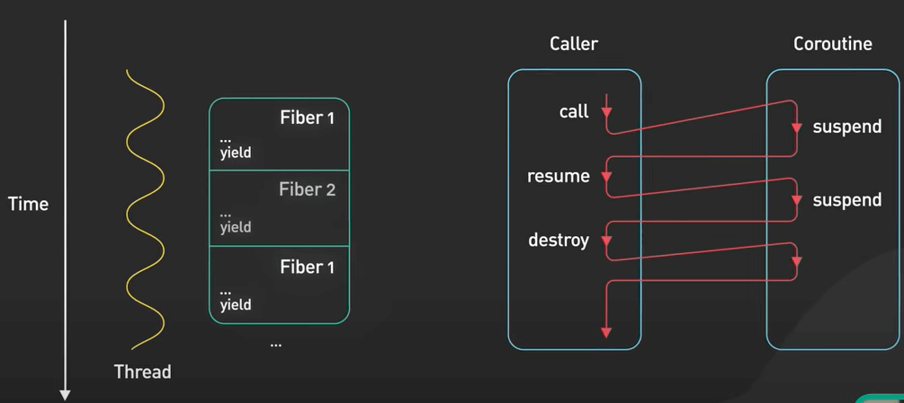
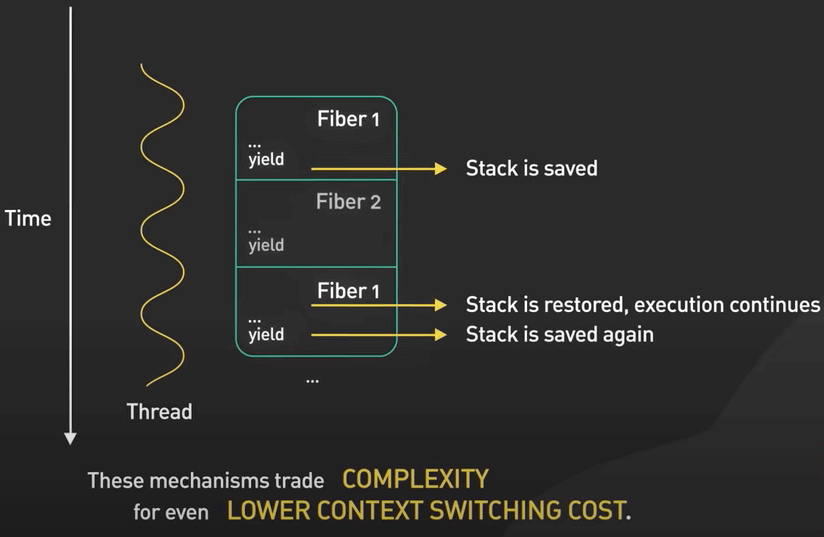

# Process vs. Thread

## Nguồn

 [FANG Interview Question | Process vs Thread](https://www.youtube.com/watch?v=4rLW7zg21gI)

## Chương trình (Program) là gì?

Một **chương trình** (Program) là một file thực thi (executable). Nó chứa mã nguồn, hoặc một tập các hướng dẫn xử lý được lưu trữ thành một file trên ổ đĩa.

{ style="display: block; margin: 0 auto" }

## Tiến trình (Process) là gì?

Khi mã nguồn của chương trình được đưa vào trong bộ nhớ và được thực thi bởi bộ xử lý, nó trở thành một **tiến trình** (Process).

{ style="display: block; margin: 0 auto" }

Một process đang hoạt động cũng cần tài nguyên mà chương trình cần để chạy. Tài nguyên này được quản lý bởi hệ điều hành. Một số ví dụ như thanh ghi xử lý, bộ đếm chương trình, con trỏ stack, các trang bộ nhớ được chỉ định cho stack và heap của process, vân vân...

Mỗi process có không gian địa chỉ bộ nhớ riêng. Một process không thể gây hại đến không gian bộ nhớ của một process khác. Điều này có nghĩa là nếu một process gặp sự cố, các process khác vẫn có thể tiếp tục chạy. Trình duyệt Chrome vận dụng điều này rất tốt. Mỗi tab của Chrome là một process. Khi một tab gặp sự cố do lỗi hay bị tấn công, các tab khác không bị ảnh hưởng.

## Luồng (Thread) là gì?

**Luồng** (thread) là một đơn vị thực thi bên trong một process. Mỗi process có ít nhất một thread, còn gọi là main thread. Một process có thể có nhiều thread.

{ style="display: block; margin: 0 auto" }

Mỗi thread có một stack riêng. Trước đó ta đề cập đến việc các thanh ghi, bộ đếm chương trình, con trỏ stack là một phần của một process. Giờ ta có thể nói đúng hơn rằng chúng là một phần của một thread.

Các thread trong một process chia sẻ cùng một không gian địa chỉ bộ nhớ. Không gian địa chỉ bộ nhớ chung này cũng có thể được dùng để giao tiếp giữa các thread với nhau. Tuy nhiên, một thread gặp sự cố có thể dẫn đến cả process gặp lỗi.

{ style="display: block; margin: 0 auto" }

## Hệ điều hành khởi chạy thread hoặc process trên CPU như thế nào?

Việc này được thực hiện bởi **context switching** (thay đổi bối cảnh).

{ style="display: block; margin: 0 auto" }

Trong khi đang context switch, một process được mang ra (switch) khỏi CPU để cho một process khác có thể chạy. Hệ điều hành lưu trạng thái của process hiện tại (bị switch ra) để có thể khôi phục và tiếp tục chạy vào một thời điểm khác. Sau đó nó khôi phục trạng thái trước đó của một process khác và tiếp tục chạy process đó.

{ style="display: block; margin: 0 auto" }

{ style="display: block; margin: 0 auto" }

Context switch rất tốn kém. Nó bao gồm việc lưu và tải dữ liệu vào thanh ghi, thay đổi trang bộ nhớ, và cập nhật nhiều cấu trúc dữ liệu trong kernel. Thay đổi thực thi giữa các luồng cũng cần context switching.

{ style="display: block; margin: 0 auto" }

{ style="display: block; margin: 0 auto" }

Thông thường thì context switch trên thread sẽ nhanh hơn trên process. Thread thì có ít trạng thái hơn và quan trọng hơn là các thread có cùng không gian địa chỉ bộ nhớ, nên không cần phải thay đổi trang các bộ nhớ ảo, đây cũng là thao tác tốn kém nhất trong context switch.

{ style="display: block; margin: 0 auto" }

Context switch tốn kém nên có một số cơ chế để tối thiểu hoá sự tốn kém này, ví dụ như **fiber** và **coroutine**.

{ style="display: block; margin: 0 auto" }

Các cơ chế này giảm tốn kém nhưng tăng độ phức tạp của context switch. Nói chung, chúng được lên lịch một cách hợp tác với nhau, nghĩa là, một thằng phải đưa quyền điều khiển cho thằng còn lại để thằng còn lại có thể chạy, giúp cho ứng dụng tự mình lập lịch. Trách nhiệm thuộc về ứng dụng để đảm bảo rằng một task kéo dài có thể tạm ngưng bằng cách trao quyền điều khiến theo định kỳ.

{ style="display: block; margin: 0 auto" }
