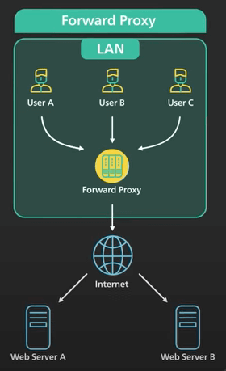
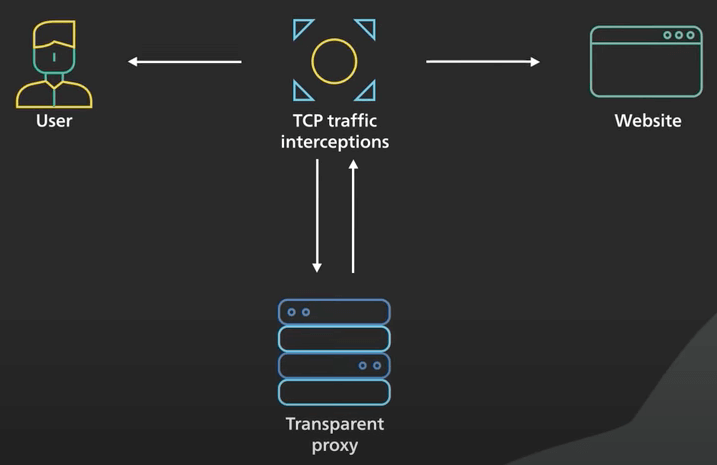
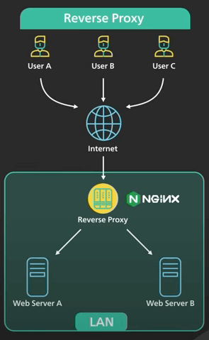
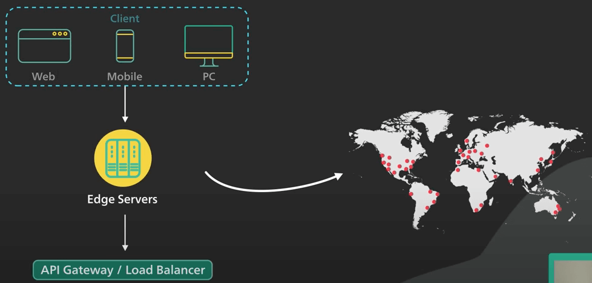

# Proxy vs. Reverse Proxy

## Nguồn

 [Proxy vs Reverse Proxy (Real-world Examples)](https://www.youtube.com/watch?v=4NB0NDtOwIQ)

## Forward Proxy

Có hai loại proxy phổ biến là forward proxy (proxy chuyển tiếp) và reverse proxy (proxy ngược).

**Forward proxy** là một server nằm giữa một nhóm các máy client và mạng internet. Khi những máy client đó gửi request lên các trang web trên mạng internet, forward proxy sẽ đóng vai trò là trung gian để chặn các request đó, và giao tiếp với web server thay mặt cho các máy client đó.

{ style="display: block; margin: 0 auto" }

Người ta cần forward proxy vì một vài lý do sau.

Thứ nhất, forward proxy bảo vệ danh tính trực tuyến của client. Bằng cách dùng forward proxy để kết nối với một trang web, địa chỉ IP của client sẽ không bị server tìm ra, server sẽ chỉ nhìn thấy địa chỉ của proxy. Như vậy sẽ khó hơn để tìm ra được client.

Thứ hai, một forward proxy có thể được sử dụng để bỏ qua các hạn chế về duyệt web. Một số tổ chức như chính phủ, trường học và doanh nghiệp lớn sử dụng tường lửa để hạn chế quyền truy cập internet. Bằng cách kết nối với forward proxy bên ngoài tường lửa, client có khả năng vượt qua những hạn chế này. Tuy nhiên không phải lúc nào cũng vượt qua được vì bản thân tường lửa có thể chặn kết nối với proxy.

Thứ ba, có thể sử dụng forward proxy để chặn quyền truy cập vào một số nội dung nhất định. Điều này không có gì lạ khi các trường học và doanh nghiệp sẽ cấu hình mạng của họ để kết nối tất cả client với web thông qua một proxy và áp dụng các bộ lọc để không cho phép truy cập các trang web như mạng xã hội. Cần lưu ý rằng forward proxy thường yêu cầu client cấu hình ứng dụng của client trỏ đến proxy. 

### Transparent Proxy

Đối với các tổ chức lớn, họ thường sử dụng một kỹ thuật gọi là **transparent proxy** (proxy minh bạch) để hợp lý hoá quá trình.

Một transparent proxy hoạt động với các công tắc tầng 4 (OSI) để tự động chuyển hướng một số loại lưu lượng truy cập nhất định đến proxy. Không cần phải cấu hình client để sử dụng nó. Rất khó để bỏ qua một transparent proxy khi client đang ở trên mạng của tổ chức.

{ style="display: block; margin: 0 auto" }

Tóm lại, forward proxy nằm giữa client và internet và hoạt động thay mặt cho client.

## Reverse Proxy

**Reverse proxy** nằm giữa internet và các web server. Nó chặn các request từ client và giao tiếp với web server thay mặt cho client.

{ style="display: block; margin: 0 auto" }

Có một số lý do vì sao một website sẽ dùng reverse proxy.

Thứ nhất, một reverse proxy có thể được sử dụng để bảo vệ một trang web. Địa chỉ IP của trang web được ẩn đằng sau reverse proxy và không được tiết lộ cho client. Điều này khiến việc tổ chức một cuộc tấn công từ chối dịch vụ (DDoS) vào một trang web trở nên khó hơn nhiều.

Thứ hai, một reverse proxy được sử dụng để cân bằng tải (load balancing). Một trang web nổi tiếng có thể phải xử lý hàng triệu người dùng mỗi ngày, nó khó có thể xử lý lưu lượng truy cập lớn như vậy với một server. Một reverse proxy có thể cân bằng một lượng lớn request đến web server bằng cách phân phối lưu lượng truy cập đến một nhóm lớn các web server, và ngăn chặn hiệu quả bất kỳ một server nào trong số chúng bị quá tải. Lưu ý rằng ta giả sử reverse proxy có thể xử lý lưu lượng truy cập đến.

Các dịch vụ như Cloudflare đặt các reverse proxy server ở hàng trăm địa điểm trên khắp thế giới. Điều này đặt reverse proxy gần với người dùng, và đồng thời cung cấp dung lượng xử lý lớn.

Thứ ba, một reverse proxy có thể cache các static content. Một phần của content có thể được cache vào reverse proxy trong một khoảng thời gian. Nếu cùng một phần content đó dược request lại từ reverse proxy, thông tin đã cache có thể được trả về nhanh chóng.

Thứ tư, reverse proxy có thể xử lý mã hoá SSL. Bắt tay SSL rất tốn kém về mặt tính toán. Một reverse proxy có thể giải phóng các server khỏi các thao tác tốn kém này. THay vì xử lý SSL cho tất cả client, một trang web chỉ cần xử lý bắt tay SSL từ một số ít reverse proxy.

## Các lớp reverse proxy

Reverse proxy ở khắp mọi nơi. Với một trang web hiện đại, không có gì lạ khi có nhiều lớp reverse proxy. 

Lớp đầu tiên có thể là một dịch vụ biên như Cloudflare. Các reverse proxy được triển khai tới hàng trăm địa điểm trên toàn thế giới để gần với người dùng.

Lớp thứ hai có thể là API gateway hoặc load balance tại nhà cung cấp dịch vụ host. Nhiều nhà cung cấp dịch vụ đám mây kết hợp 2 lớp này thành một dịch vụ đầu vào duy nhất.

Người dùng sẽ vào mạng đám mây ở gần với người dùng và từ đó, reverse proxy kết nối qua mạng cáp quang tốc độ cao với load balancer, nơi request được phân phối đều trên một cụm web server.

{ style="display: block; margin: 0 auto" }
