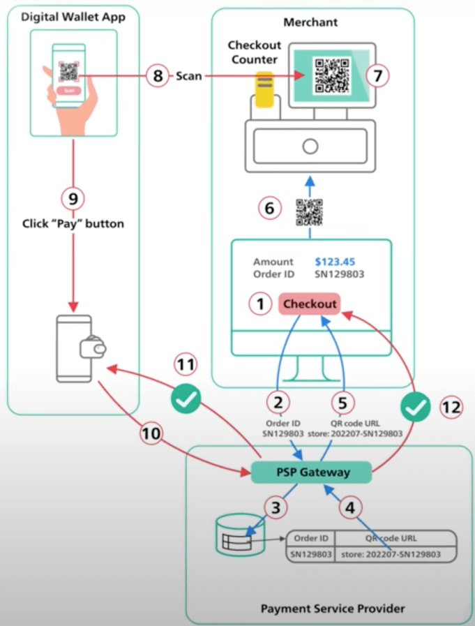

# Scan to Pay là gì?

## Nguồn

 [Scan to Pay in 2 Minutes](https://www.youtube.com/watch?v=XS8ACikD2qs)

## Scan to Pay hoạt động như thế nào?

**Scan to Pay** là một phương thức thanh toán phổ biến trong những ứng dụng ví điện tử như Paytm, PayPal và Venmo. Các ứng dụng này thanh toán bằng cách quét mã QR tại điểm bán hàng.

Để hiểu được cách thức Scan to Pay hoạt động, ta sẽ chia nó thành hai phần:

1. Sinh ra mã QR cho các điểm bán hàng và hiển thị trên màn hình.
2. Quét mã QR đó và thanh toán với ứng dụng ví điện tử.

## Sinh mã QR

Khi khách hàng muốn thanh toán, thu ngân nhấn nút Checkout **(1)**. Máy của thu ngân sẽ gửi tổng tiền và mã hoá đơn đến nhà cung cấp dịch vụ thanh toán (Payment Service Provider - PSP) **(2)**. PSP lưu thông tin này vào database và sinh ra một URL trỏ đến một mã QR **(3)**. PSP trả URL chứa mã QR đến máy tính của thu ngân **(4) (5)**. Máy của thu ngân gửi mã QR dến thiết bị thanh toán đầu cuối **(6)**. Thiết bị này sẽ hiển thị mã QR **(7)**. Tất cả các bước này sẽ được hoàn tất trong khoảng một giây. 

## Thanh toán bằng ứng dụng

Giờ khách hàng sẽ trả bằng ứng dụng ví điện tử bằng cách quét mã QR này **(8)**. Tổng tiền cần trả sẽ được hiển thị trên ứng dụng. Sau khi xác nhận tổng tiền cần thanh toán, khách bấm nút Thanh toán **(9)**. Ứng dụng ví điện tử báo cho PSP rằng QR code đã được thanh toán **(10)**. PSP đánh dấu rằng QR code đã được thanh toán và trả về thành công cho ứng dụng ví điện tử **(11)**. PSP sau đó báo cho người bán rằng khách đã trả với mã QR kia **(12)**.

{ style="display: block; margin: 0 auto" }

Đây là cách thanh toán dùng mã QR động. Nó "động" vì QR được sinh ra chỉ cho một lần sử dụng. Ta cũng có thể thanh toán bằng cách quét mã QR được in ở điểm bán hàng. Đây được gọi là mã QR tĩnh. Nó hoạt động hơi khác một chút và sẽ được đề cập trong một bài viết khác.
