# 7 kiểu hệ thống phân tán thông dụng

## Nguồn

 [Top 7 Most-Used Distributed System Patterns](https://www.youtube.com/watch?v=nH4qjmP2KEE)

## Ambassador

Đầu tiên là hệ thống kiểu **Ambassador** (đại sứ).

Tưởng tượng rằng bạn là một CEO bận rộn với một trợ lý riêng xử lý tất cả các cuộc hẹn và giao tiếp với cấp dưới cho bạn. Đó chính xác là những gì hệ thống kiểu Ambassador sẽ làm cho ứng dụng của bạn.

Nó hoạt động như một điểm trung chuyển cho ứng dụng của bạn và các service mà ứng dụng đó giao tiếp, giảm tải các tác vụ như logging, monitoring hay xử lý các lần thử lại.

Ví dụ, Kubenetes sử dụng Envoy làm Ambassador để đơn giản hoá việc giao tiếp giữa các service.

Hệ thống kiểu Ambassador sẽ giúp giảm độ trễ, tăng cường bảo mật và cải thiện kiến trúc tổng thể của các hệ thống phân tán.

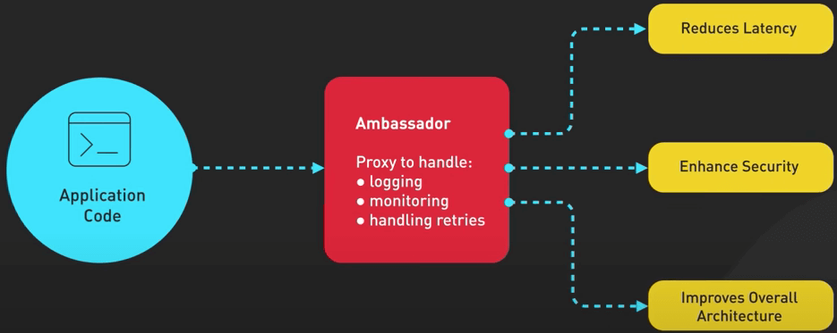{ style="display: block; margin: 0 auto" }

## Circuit Breaker

Tiếp theo là **Circuit Breaker** (bộ ngắt mạch)

Tưởng tượng một đường ống nước trong nhà bạn bị vỡ. Điều đầu tiên bạn cần làm là khoá van chính để tránh hỏng thêm. Hệ thống kiểu Circuit Breaker hoạt động tương tự, ngăn lỗi phân tầng trong các hệ thống phân tán. 

Khi một service bị hỏng, Circuit Breaker sẽ dừng các request, cho phép service đó khôi phục lại. Thư viện Hystrix của Netflix sử dụng thiết kế này. 

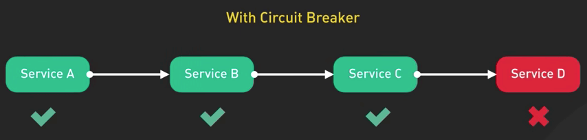{ style="display: block; margin: 0 auto" }

Nó đảm bảo một hệ thống linh hoạt hơn. Thiết kế này có thể đặc biệt hữu ích khi xử lý các microservice hoặc ứng dụng đám mây, nơi có nhiều khả năng xảy ra lỗi hơn.

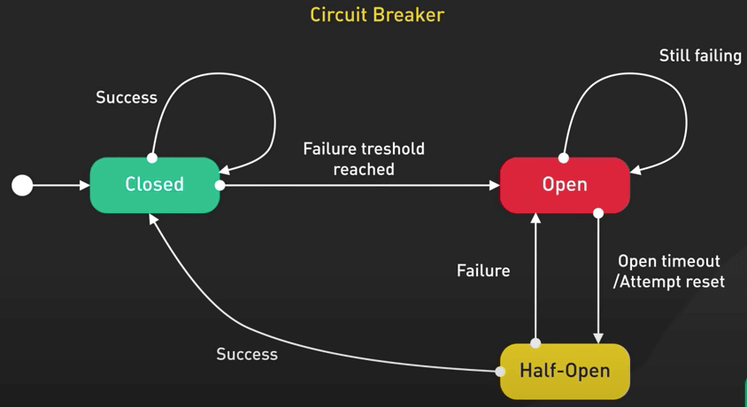{ style="display: block; margin: 0 auto" }

## CQRS

Thiết kế tiếp theo là **CQRS** (**C**ommand **Q**uery **R**esponsibility **S**egregation - Phân tách trách nhiệm truy vấn lệnh). CQRS giống như việc có một nhà hàng với các hàng đợi riêng biệt để gọi món và nhận món.

Bằng việc tách riêng các thao tác ghi và đọc, ta có thể mở rộng quy mô và tối ưu hóa từng thao tác một cách độc lập.

Ví dụ, một trang thương mại điện tử có thể có nhiều request đọc sản phẩm nhưng ít request ghi để đặt hàng hơn.

CQRS cho phép xử lý từng thao tác một cách hiệu quả. Thiết kế kiểu này trở nên hiệu quả trong các hệ thống mà hoạt động đọc và ghi có các đặc điểm hiệu suất khác nhau, với các yêu cầu về độ trễ hoặc tài nguyên khác nhau.

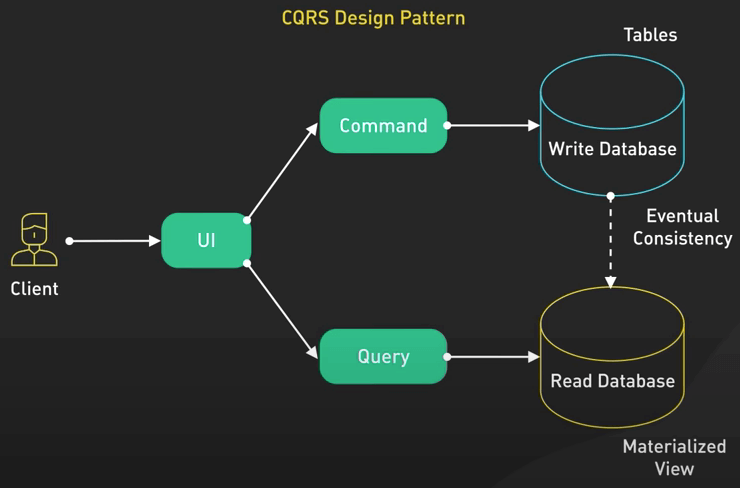{ style="display: block; margin: 0 auto" }

## Event Sourcing

Tiếp theo là **Event Sourcing**. Ta có thể xem Event Sourcing như việc ghi nhật ký về các sự kiện xảy ra trong cuộc sống. Thay vì cập nhật trực tiếp các bản ghi, ta lưu các sự kiện đại diện cho các thay đổi đã xảy ra.

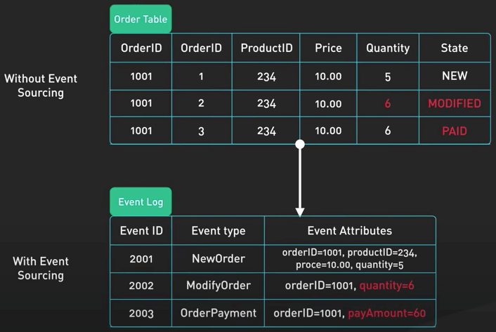{ style="display: block; margin: 0 auto" }

Phương pháp này cung cấp toàn bộ lịch sử của hệ thống, đồng thời cho phép kiểm tra và gỡ lỗi tốt hơn.

Git version control là một ví dụ hay về Event Sourcing, trong đó mỗi commit tượng trưng cho một thay đổi gì đó.

Với Event Sourcing, ta có thể triển khai các tính năng nâng cao như time-travel debugging hoặc phát lại các sự kiện với mục đích phân tích.

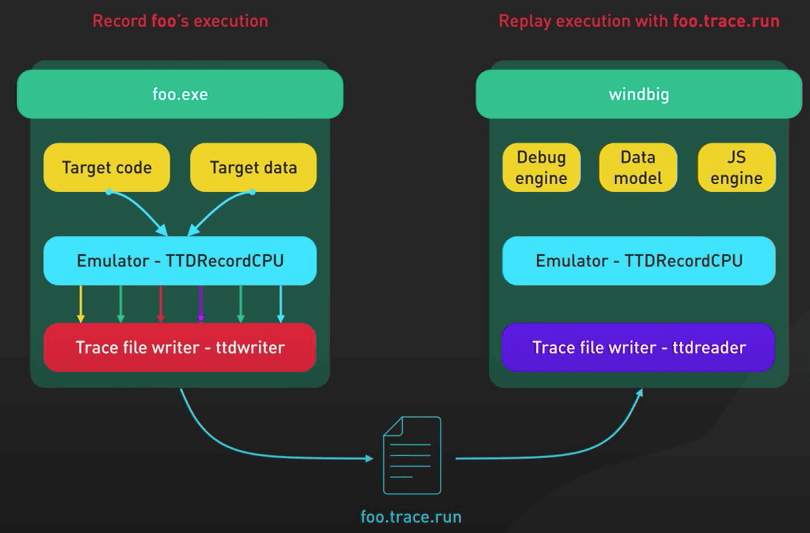{ style="display: block; margin: 0 auto" }

## Leader Election

Tưởng tượng rằng ta có một lớp học gồm các học sinh bầu ra một lớp trưởng.

Trong một hệ thống phân tán, thiết kế kiểu **Leader Election** đảm bảo chỉ một node chịu trách nhiệm về một nhiệm vụ hoặc tài nguyên cụ thể. Khi một node leader bị lỗi, các node còn lại sẽ bầu ra một node leader mới.

ZooKeeper và etcd sử dụng thiết kế này để quản lý cấu hình phân tán.

Bằng cách có một leader được chỉ định, ta có thể tránh xung đột và đảm bảo việc ra quyết định nhất quán trên toàn hệ thống phân tán.

{ style="display: block; margin: 0 auto" }

## Pub / Sub

Thiết kế **Publisher / Subscriber** (xuất bản / đăng ký, viết tắt là pub/sub) giống như một dịch vụ chuyển phát báo. Pub/Sub giống như một dịch vụ chuyển phát báo.

Các publisher phát ra các event mà không biết ai sẽ nhận các event đó, và các subscriber lắng nghe các event mà chúng quan tâm.

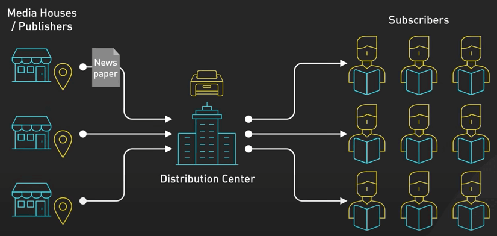{ style="display: block; margin: 0 auto" }

Thiết này cho phép khả năng mở rộng và tính mô-đun hoá tốt hơn.

Ví dụ, Google Cloud Pub/Sub cho phép nhắn tin không đồng bộ giữa các service, giúp việc bảo trì và mở rộng các ứng dụng phức tạp trở nên dễ dàng hơn.

Các hệ thống Pub/Sub rất phù hợp với các trường hợp khi ta cần phổ biến các thay đổi hoặc cập nhật trên nhiều thành phần, chẳng hạn như cập nhật hồ sơ của người dùng trên các service khác nhau.

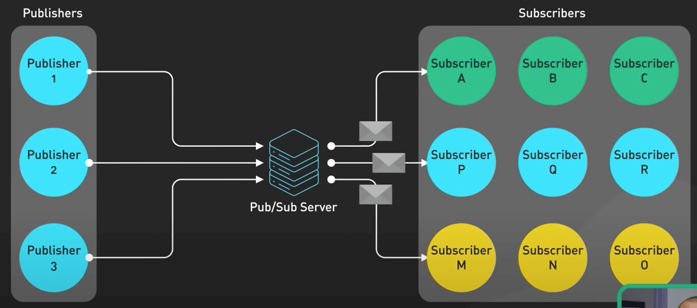{ style="display: block; margin: 0 auto" }

## Sharding

**Sharding** giống như việc chia một chiếc bánh pizza lớn thành những lát nhỏ hơn để dễ xử lý hơn.

Đây là một kỹ thuật phân phối dữ liệu trên nhiều node trong một hệ thống.

Nó cải thiện hiệu suất và khả năng mở rộng.

Mỗi shard chứa một tập hợp con dữ liệu, giúp giảm tải cho bất kỳ node nào.

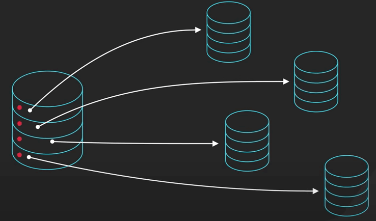{ style="display: block; margin: 0 auto" }

Các cơ sở dữ liệu như MongoDB và Cassandra sử dụng sharding để xử lý lượng lớn dữ liệu một cách hiệu quả.
 
Sharding cũng có thể giúp ta đạt được data locality tốt hơn, giảm độ trễ của mạng và tăng tốc thực thi truy vấn.

{ style="display: block; margin: 0 auto" }

## Bonus

Trong phần này ta sẽ nói về thiết kế kiểu Strangler Fig.

Thiết kế này được lấy cảm hứng từ cây sung bóp cổ, là cây mọc xung quanh các cây khác và cuối cùng thay thế chúng.

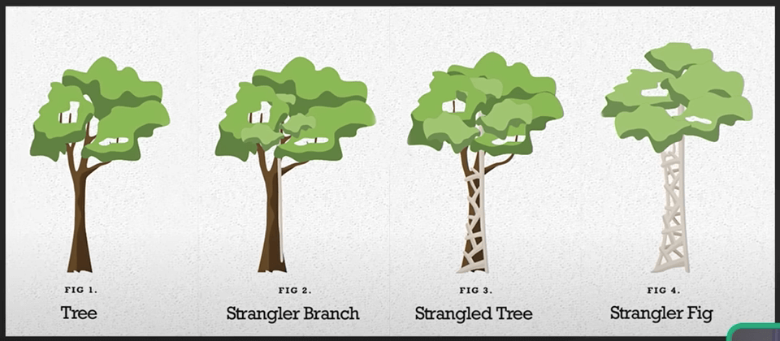{ style="display: block; margin: 0 auto" }

Trong phần mềm, thiết kế Strangler Fig là một phương pháp để dần dần thay thế các hệ thống cũ bằng các hệ thống mới.

Thay vì thực hiện migrate thẳng sang hệ thống mới một cách đầy rủi ro, ta có thể thay thế từng phần của hệ thống cũ bằng các thành phần mới.

Thiết này có thể giúp ta quản lý rủi ro và sự phức tạp liên quan đến việc migrate hệ thống.

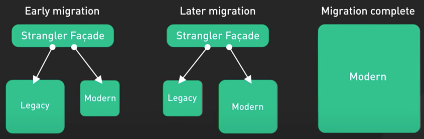{ style="display: block; margin: 0 auto" }
