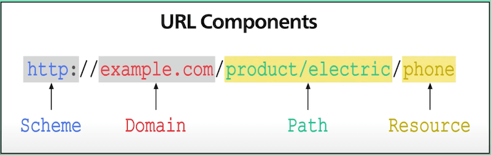
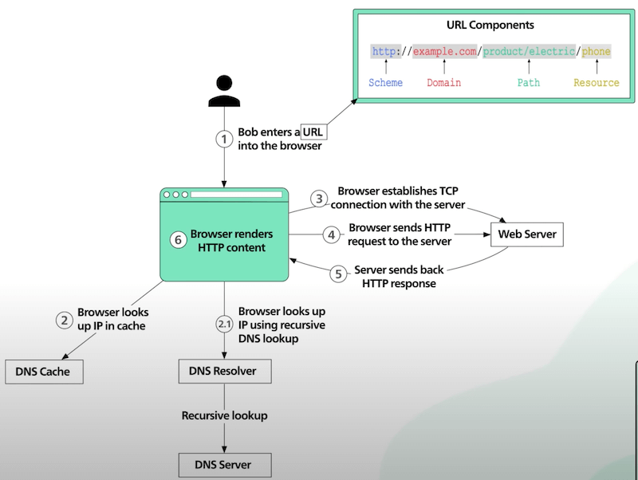

# Chuyện gì sẽ xảy ra khi ta truy cập vào một đường dẫn (URL) trên trình duyệt?

## Nguồn

 [What happens when you type a URL into your browser?](https://www.youtube.com/watch?v=AlkDbnbv7dk)

## URL là gì?

**URL**, hay tên đầy đủ là **Universal Resources Locator**, bao gồm 4 phần. Ví dụ với URL sau:

{ style="display: block; margin: 0 auto" }

Trong đó:

- **Scheme** cho trình duyệt biết rằng ta sẽ kết nối đến một server bằng giao thức trong scheme (ở đây là giao thức HTTP). Một scheme phổ biến khác là HTTPS, với sự khác biệt là kết nối đến server sẽ được mã hoá.
- **Domain** là tên miền của website.
- **Path** và **Resource** thường không có sự khác biệt rõ ràng. Có thể xem chúng lần lượt là thư mục và tập tin trong một ổ cứng bình thường. Chúng kết hợp với nhau tạo thành tài nguyên và ta muốn tải về trình duyệt.

## DNS là gì?

**DNS**, hay tên đầy đủ là **Domain Name System**, được xem như cuốn danh bạ trên internet. DNS có tác dụng chuyển đổi tên miền thành địa chỉ IP giúp trình duyệt có thể xác định được tài nguyên cần tìm nằm ở đâu trên mạng internet.

Thông thường, địa chỉ IP ứng với tên miền được cached lại ngay tại trình duyệt trong một khoảng thời gian ngắn sau khi trình duyệt truy cập vào một URL. Cache này cũng hiện diện trong hệ điều hành để lấy được IP nhanh hơn là khi phải tra trong DNS.

## Vậy chuyện gì sẽ xảy ra khi truy cập vào một đường dẫn (URL) trên trình duyệt?

{ style="display: block; margin: 0 auto" }

Đầu tiên, người dùng sẽ gõ URL vào thanh địa chỉ (Address) trên trình duyệt.

Sau đó, trình duyệt sẽ thử tìm IP ứng với tên miền của URL trong cache của nó. Nếu không tìm ra, trình duyệt sẽ hỏi cache của hệ điều hành để lấy được địa chỉ IP. Nếu vẫn không tìm ra, ta đến bước tiếp theo.

Trình duyệt sẽ gửi truy vấn lên DNS Resolver để tìm ra địa chỉ IP. Việc này bao gồm một chuỗi các yêu cầu cho đến khi có được địa chỉ IP. DNS Resolver sẽ tìm trong các DNS Server trên internet để giúp trình duyệt tìm IP. Lưu ý là mỗi yêu cầu trong chuỗi các yêu cầu đều được cached lại nhằm giúp cho DNS Resolver cũng như các DNS Server thuận tiện hơn cho những lần tìm kiếm tiếp theo.

Sau bước 2, giờ ta đã có địa chỉ IP của URL. Trình duyệt lúc này sẽ tạo ra một kết nối TCP đến server ứng với địa chỉ IP này. Quá trình bắt tay giữa trình duyệt và server cũng sẽ xảy ra ở đây (thường là bắt tay 3 bước). Để giúp cho việc kết nối diễn ra nhanh hơn, các trình duyệt ngày nay dùng một thứ gọi là kết nối keep-alive để sử dụng lại kết nối TCP đã được tạo nhiều nhất có thể.

Nếu giao thức là HTTPS, quá trình kết nối sẽ có nhiều bước hơn. Nó yêu cầu một quá trình bắt tay phức tạp hơn gọi là bắt tay SSL/TLS để tạo ra kết nối an toàn (đã được mã hoá) giữa trình duyệt và server. Quá trình bắt tay này tốn kha khá tài nguyên và trình duyệt thường sử dụng một trick gọi là SSL session resumption để tiết kiệm tài nguyên.

Ở bước 4, trình duyệt gửi HTTP request lên server với kết nối TCP trước đó. HTTP là một giao thức khá đơn giản. Server xử lý request và trả về response ở bước 5. Trình duyệt nhận response và render HTML content cho chúng ta.

Ngoài ra ta còn có thêm những tài nguyên khác để tải về như JS bundles hay hình ảnh. Trình duyệt sẽ thực hiện lại các bước trên để lấy tất cả các tài nguyên đó về.
