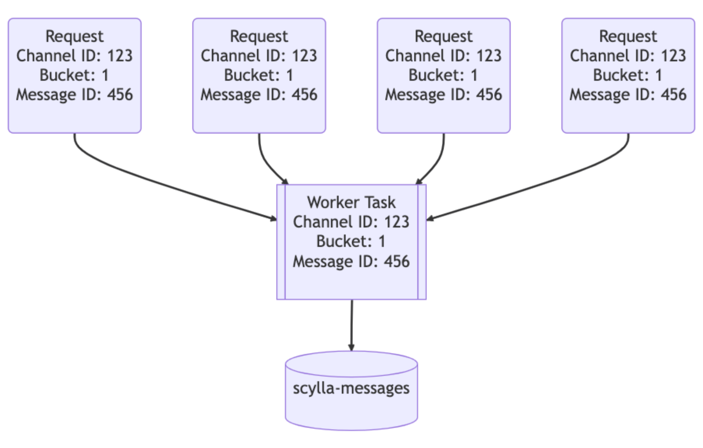
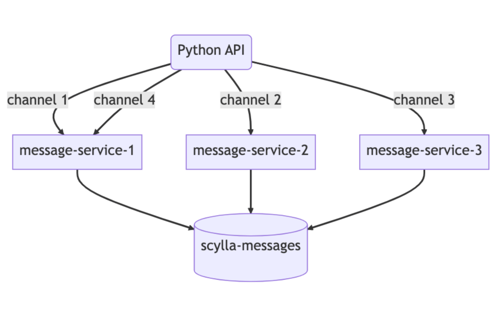
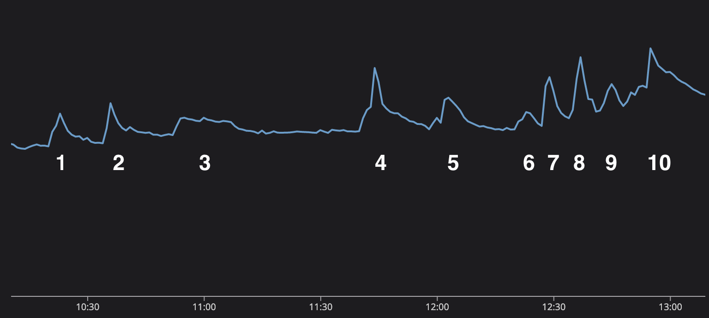
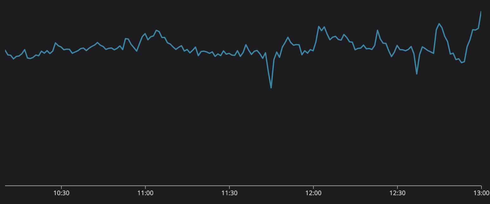

# Discord lưu hàng nghìn tỉ tin nhắn như thế nào?

## Nguồn

[How Discord stores trillions of messages - Bo Ingram](https://discord.com/blog/how-discord-stores-billions-of-messages)

## Lời tựa

Vào năm 2017, chúng tôi đã viết một bài về [cách lưu trữ hàng tỉ tin nhắn trên Discord](https://discord.com/blog/how-discord-stores-billions-of-messages). Chúng tôi đã chia sẻ hành trình của mình về cách bắt đầu sử dụng MongoDB rồi di chuyển dữ liệu của mình sang Cassandra vì lúc đó chúng tôi tìm kiếm một database có thể mở rộng, chịu lỗi và chi phí bảo trì tương đối thấp. Chúng tôi biết mình sẽ phát triển và chúng tôi đã làm được!

Chúng tôi muốn có một loại database phát triển cùng, nhưng cũng hy vọng rằng nhu cầu bảo trì của nó sẽ không phát triển cùng với nhu cầu lưu trữ của chúng tôi. Thật không may, đời không như là mơ — cluster Cassandra của chúng tôi có các vấn đề nghiêm trọng về hiệu suất đòi hỏi phải tăng cường nỗ lực để bảo trì chứ không phải cải thiện.

Gần sáu năm sau, chúng tôi đã thay đổi rất nhiều và cách lưu trữ tin nhắn cũng vậy.

## Vấn đề với Cassandra

Chúng tôi lưu tin nhắn trong database có tên là `cassandra-messages`. Đúng như tên gọi của nó, nó chạy bằng Cassandra và lưu trữ các tin nhắn. Vào năm 2017, chúng tôi đã chạy 12 node Cassandra, lưu trữ hàng tỷ tin nhắn.

Vào đầu năm 2022, nó phình ra thành 177 node với hàng nghìn tỷ tin nhắn. Đó là một hệ thống cực kỳ phức tạp — team on-call của chúng tôi thường xuyên được phân ra để giải quyết các sự cố với database, độ trễ không kiểm soát và chúng tôi phải cắt giảm các hoạt động bảo trì vốn trở nên quá tốn kém để vận hành.

Điều gì đã gây ra những vấn đề này? Đầu tiên, cùng xem cấu trúc của bảng nhé.

```sql
CREATE TABLE messages (
   channel_id bigint,
   bucket int,
   message_id bigint,
   author_id bigint,
   content text,
   PRIMARY KEY ((channel_id, bucket), message_id)
) WITH CLUSTERING ORDER BY (message_id DESC);
```

Ở trên là bản thu gọn của bảng trong thực tế. Mỗi ID ở đây là một [Snowflake](https://blog.twitter.com/engineering/en_us/a/2010/announcing-snowflake), nên nó có thể được sắp xếp theo trình tự thời gian. Chúng tôi phân vùng các tin nhắn của mình theo channel mà chúng được gửi đến, cùng với một bucket, là phạm vi thời gian tĩnh. Việc phân vùng này có nghĩa là, trong Cassandra, tất cả các thông báo cho một channel và bucket nhất định sẽ được lưu cùng nhau và sao chép trên 3 node (hoặc nhiều hơn tuỳ theo hệ số replica).

Trong phân vùng này có một lỗ hổng hiệu suất: một server Discord nhỏ có xu hướng gửi ít tin nhắn (và mật độ cũng ít) hơn so với một server có hàng trăm nghìn người.

Trong Cassandra, việc đọc tốn chi phí hơn việc ghi. Các lần ghi được thêm vào commit log và được ghi vào cấu trúc trong bộ nhớ được gọi là memtable sau đó được chuyển vào đĩa. Tuy nhiên, các lần đọc cần truy vấn memtable và có khả năng là nhiều SSTable (file trên đĩa), đây là một thao tác tốn kém hơn. Rất nhiều lần đọc cùng lúc khi người dùng tương tác với máy chủ có thể tạo điểm nóng cho một phân vùng mà chúng tôi nhanh là "phân vùng nóng" (hot partition). Kích thước dataset của chúng tôi khi được kết hợp với các pattern truy cập này đã dẫn đến khó khăn cho cluster.

Khi chúng tôi gặp một phân vùng nóng, nó thường ảnh hưởng đến độ trễ trên toàn bộ cluster database. Một cặp channel và bucket đã nhận được một lượng lớn lưu lượng truy cập và độ trễ trong node sẽ tăng lên khi node đó cố gắng phục vụ lưu lượng truy cập và ngày càng tụt lại phía sau.

Các truy vấn khác đến node này đã bị ảnh hưởng do node không thể theo kịp. Vì chúng tôi thực hiện đọc và ghi với mức quorum consistency cần thiết, nên tất cả các truy vấn tới các node phục vụ phân vùng nóng đều bị tăng độ trễ, dẫn đến tác động lớn hơn đến người dùng.

Việc bảo trì cluster cũng thường xuyên gây ra sự cố. Chúng tôi dễ bị tụt lại phía sau khi nén, trong đó Cassandra sẽ nén SSTable trên đĩa để đọc hiệu quả hơn. Khi đó, các lần đọc của chúng tôi không chỉ tốn kém hơn mà chúng tôi còn thấy độ trễ cascading tăng khi một node cố gắng để nén.

Chúng tôi thường xuyên thực hiện một thao tác mà chúng tôi gọi là "gossip dance", trong đó chúng tôi sẽ lấy một node ra khỏi vòng quay để nén nó mà không chiếm lưu lượng truy cập, sau đó đưa nó trở lại để nhận các gợi ý từ bàn giao gợi ý của Cassandra, sau đó lặp lại cho đến khi hết tồn đọng nén. Chúng tôi cũng đã dành một lượng lớn thời gian để điều chỉnh garbage collector của JVM và các cài đặt heap, bởi vì việc tạm dừng GC sẽ tăng độ trễ lên đáng kể.

## Sự thay đổi về kiến trúc

Cluster tin nhắn của chúng tôi không phải là database Cassandra duy nhất. Chúng tôi có một số cluster khác và mỗi cluster đều có lỗi như vậy (mặc dù có lẽ không nghiêm trọng bằng).

Trong bài [Làm sao để lưu hàng tỉ tin nhắn](https://discord.com/blog/how-discord-stores-billions-of-messages), chúng tôi đã đề cập đến việc quan tâm bởi ScyllaDB, một database tương thích với Cassandra được viết bằng C++. Hiệu suất tốt hơn, sửa chữa nhanh hơn, cách ly khối lượng công việc mạnh mẽ hơn thông qua kiến trúc phân đoạn trên mỗi core và không có garbage collection nghe có vẻ khá hấp dẫn.

Mặc dù ScyllaDB không phải là không có vấn đề gì, nhưng quan trọng là nó không có garbage collector, vì nó được viết bằng C++ chứ không phải Java. Trước đây, team đã gặp nhiều sự cố với garbage collector trên Cassandra, từ việc tạm dừng GC ảnh hưởng đến độ trễ, cho đến các lần tạm dừng GC siêu dài liên tiếp nhau khiến người vận hành phải khởi động lại theo cách thủ công và để ý node đó xem nó có ổn trở lại không. Những vấn đề này là nguyên nhân gây ra rất nhiều khó khăn khi on-call và là gốc rễ của nhiều vấn đề về độ ổn định trong cluster tin nhắn.

Sau khi thử nghiệm với ScyllaDB và quan sát các cải tiến trong quá trình thử nghiệm, chúng tôi đã đưa ra quyết định di chuyển tất cả các database của mình. Mặc dù chính quyết định này cũng có thể có một bài viết riêng, nhưng tóm tắt là vào năm 2020, chúng tôi đã di chuyển mọi database trừ một cái sang ScyllaDB, chính là con quái vật `cassandra-messages`.

Sao vẫn chưa chuyển nó? Đầu tiên, nó là một cái cluster siêu to khổng lồ. Với hàng nghìn tỷ tin nhắn và gần 200 node, chuyển thứ này sang ScyllaDB tốn rất nhiều công sức. Ngoài ra, chúng tôi muốn đảm bảo rằng database mới có thể hoạt động tốt nhất có thể khi chúng tôi điều chỉnh hiệu suất của nó cho phù hợp. Chúng tôi cũng muốn có thêm kinh nghiệm với ScyllaDB trên môi trường live và tìm hiểu những vấn đề của nó.

Chúng tôi cũng đã làm việc để cải thiện hiệu suất ScyllaDB cho các use case của mình. Trong quá trình thử nghiệm, chúng tôi phát hiện ra rằng hiệu suất của các truy vấn đảo ngược (reverse query) không đủ cho nhu cầu. Chúng tôi thực hiện một truy vấn đảo ngược khi chúng tôi thử quét database theo thứ tự ngược lại với thứ tự sắp xếp của bảng, chẳng hạn như khi chúng tôi quét tin nhắn theo thứ tự tăng dần. Team ScyllaDB đã ưu tiên các cải tiến và triển khai các truy vấn ngược hiệu quả, qua đó giúp loại bỏ vấn đề cuối cùng trong kế hoạch di chuyển database.

Chúng tôi đã nghi ngờ rằng việc đưa một database mới vào hệ thống sẽ không giúp mọi thứ tốt hơn một cách kỳ diệu được. Các phân vùng nóng (hot partition) vẫn có thể là một vấn đề trong ScyllaDB và vì vậy chúng tôi cũng muốn đầu tư vào việc cải thiện hệ thống phía trên database để giúp bảo vệ và tạo điều kiện cho hiệu suất database tốt hơn.

## Các Data Service

Với Cassandra, chúng tôi phải vật lộn với các phân vùng nóng. Lưu lượng truy cập cao vào một phân vùng nhất định dẫn đến độ trễ xếp tầng, trong đó các truy vấn tiếp theo sẽ tiếp tục tăng độ trễ. Nếu chúng ta có thể kiểm soát lượng truy cập đồng thời đến các phân vùng nóng, chúng ta có thể bảo vệ database không bị quá tải.

Để làm được điều này, chúng tôi tạo ra thứ gọi là các data service — dịch vụ trung gian nằm giữa khối API và database cluster. Khi viết các data service của mình, chúng tôi đã chọn một ngôn ngữ [ngày càng được dùng nhiều](https://discord.com/blog/why-discord-is-switching-from-go-to-rust) tại Discord: Rust! Chúng tôi đã sử dụng nó cho một vài project trước đây và nó đã đáp ứng được kỳ vọng. Nó mang lại cho chúng tôi tốc độ C/C++ nhanh mà không phải hy sinh tính an toàn.

Rust không sợ concurrency, một lợi thế lớn của nó, ngôn ngữ này sẽ giúp bạn dễ dàng viết concurrency code một cách an toàn. Các thư viện của nó cũng rất phù hợp với những gì chúng tôi muốn làm. [Hệ sinh thái Tokio](https://tokio.rs/) là một nền tảng to lớn để xây dựng một hệ thống bất đồng bộ I/O và ngôn ngữ này có hỗ trợ driver cho cả Cassandra và ScyllaDB.

Ngoài ra, chúng tôi thấy rất vui khi viết code với sự trợ giúp của compiler, sự rõ ràng của các thông báo lỗi, cấu trúc ngôn ngữ và sự nhấn mạnh về tính an toàn. Chúng tôi trở nên khá thích cách mà một khi code được biên dịch, nó thường hoạt động tốt. Tuy nhiên, điều quan trọng nhất là nó cho phép chúng tôi nói rằng chúng tôi đã viết lại nó bằng Rust.

Các data service nằm giữa API và các ScyllaDB cluster. Chúng chứa một gRPC endpoint cho mỗi truy vấn database và cố ý không chứa business logic. Tính năng quan trọng mà các data service của chúng tôi cung cấp là kết hợp request (request coalescing). Nếu nhiều người dùng đang request cùng một row cùng lúc, nó sẽ chỉ truy vấn database một lần. Người dùng đầu tiên đưa ra request sẽ khiến worker task xuất hiện trong server. Các request tiếp theo sẽ kiểm tra sự tồn tại của worker task đó và theo dõi nó. Worker task đó sẽ truy vấn database và trả lại row cho tất cả các bên theo dõi.

Đây chính là sức mạnh của Rust: nó giúp dễ dàng viết concurrent code một cách an toàn.

{ style="display: block; margin: 0 auto" }

Tưởng tượng rằng có một thông báo lớn trên một server Discord có tag `@everyone`: người dùng sẽ mở ứng dụng và đọc tin nhắn, gửi hàng tấn lưu lượng truy cập đến database. Trước đây, điều này có thể tạo ra một phân vùng nóng và on-call sẽ phải theo ca để giúp hệ thống phục hồi. Với các data service này, chúng tôi có thể giảm đáng kể lưu lượng truy cập tăng đột biến đối với database.

Phần thứ hai của phép thuật ở đây là phần trên của các data service. Chúng tôi đã triển khai định tuyến dựa trên hàm băm nhất quán cho các data service để cho phép kết hợp request hiệu quả hơn. Đối với mỗi request đến data service, chúng tôi cung cấp một khóa định tuyến (routing key). Đối với tin nhắn, đây là `channel_id`, vì vậy tất cả các request cho cùng một channel sẽ chuyển đến cùng một instance của service. Định tuyến này tiếp tục giúp giảm tải cho database.

{ style="display: block; margin: 0 auto" }

Những cải tiến này giúp ích rất nhiều, nhưng chúng không giải quyết được tất cả các vấn đề của chúng tôi. Chúng tôi vẫn thấy các phân vùng nóng và độ trễ tăng lên trên cluster Cassandra, chỉ là không quá thường xuyên như trước. Nó giúp câu giờ để chúng tôi có thể chuẩn bị cluster ScyllaDB tối ưu mới của mình và thực hiện quá trình di chuyển.

## Chuyến di cư siêu to khổng lồ

Các yêu cầu đối với việc di cư khá đơn giản: chúng tôi cần di chuyển hàng nghìn tỷ tin nhắn mà không có downtime và cần thực hiện điều đó một cách nhanh chóng bởi vì mặc dù tình hình của Cassandra đã phần nào được cải thiện, nhưng chúng tôi vẫn thường xuyên phải tự sửa.

Bước một thì khá dễ: chúng tôi cung cấp một cluster ScyllaDB mới bằng cách sử dụng [cấu trúc liên kết lưu trữ super-disk](https://discord.com/blog/how-discord-supercharges-network-disks-for-extreme-low-latency). Bằng cách sử dụng các SSD cục bộ để tăng tốc độ và tận dụng RAID để mirror dữ liệu của sang persistent disk, chúng tôi có được tốc độ của SSD cục bộ cùng với độ bền của persistent disk. Đến đây thì chúng tôi có thể bắt đầu di chuyển dữ liệu vào cluster được rồi.

Chúng tôi sẽ bắt đầu sử dụng cluster ScyllaDB mới cho dữ liệu mới hơn bằng cách sử dụng thời gian cutover, sau đó di chuyển dữ liệu lịch sử đằng sau cluster đó. Điều này làm tăng thêm độ phức tạp, nhưng được cái là an toàn.

Chúng tôi bắt đầu ghi dữ liệu mới vào cả Cassandra và ScyllaDB, đồng thời bắt đầu cung cấp trình di chuyển Spark của ScyllaDB. Nó cần được chỉnh khá nhiều và sau khi thiết lập xong, thời gian ước tính để hoàn thành là ba tháng.

Ba tháng dài quá, chúng tôi muốn nhanh hơn. Chúng tôi ngồi lại suy nghĩ về cách để có thể tăng tốc, cho đến khi nhớ rằng mình đã viết một thư viện database nhanh và hiệu quả mà chúng tôi có thể mở rộng được. Chúng tôi chọn một số kỹ thuật dựa trên meme và viết lại trình di chuyển dữ liệu bằng Rust.

Trong một buổi chiều, chúng tôi đã mở rộng thư viện data service của mình để thực hiện di chuyển dữ liệu quy mô lớn. Nó đọc phạm vi token từ database, kiểm tra chúng cục bộ thông qua SQLite, sau đó đưa vào ScyllaDB. Chúng tôi kết nối trình di chuyển mới vào và nhận được thời gian ước tính mới: 9 ngày!

Chúng tôi bật nó lên và để cho nó chạy, di chuyển tin nhắn với tốc độ lên tới 3,2 triệu mỗi giây. Vài ngày sau, chúng tôi xem nó đạt 100% và nhận ra rằng nó bị kẹt ở mức hoàn thành 99,9999% (không, thiệt đó). Trình di chuyển của chúng tôi sắp hết thời gian đọc một số phạm vi token cuối cùng vì chúng chứa các phạm vi tombstone khổng lồ chưa bao giờ được nén trong Cassandra. Chúng tôi nén phạm vi token đó và vài giây sau, quá trình di chuyển hoàn tất!

Chúng tôi đã thực hiện xác thực dữ liệu tự động bằng cách gửi một tỷ lệ phần trăm nhỏ số lần đọc tới cả 2 database và so sánh kết quả, và mọi thứ trông rất tuyệt. Cluster mới hoạt động tốt với lưu lượng như bên Cassandra, trong khi chính Cassandra đang gặp phải các vấn đề về độ trễ ngày càng thường xuyên hơn. Chúng tôi đã tập hợp lại tại chỗ ngồi của team, bật công tắc để biến ScyllaDB thành database chính và ăn mừng!

## Vài tháng sau đó

Chúng tôi đã chuyển đổi database tin nhắn của mình vào tháng 5 năm 2022, nhưng kể từ đó đến nay database này có ổn không?

Đó là một database hoạt động rất tốt. Không còn những cuộc sửa lỗi kéo dài cả tuần, cũng không tung hứng các node trong cluster để cố gắng duy trì thời gian hoạt động. Đó là một database hiệu quả hơn nhiều — chúng tôi đang chuyển từ chạy 177 node Cassandra sang chỉ 72 node ScyllaDB. Mỗi node ScyllaDB có 9 TB dung lượng ổ đĩa, tăng từ mức trung bình 4 TB cho mỗi node Cassandra.

Độ trễ đuôi cũng được cải thiện đáng kể. Ví dụ: tìm tin nhắn trong quá khứ có p99 trong khoảng 40-125 ms trên Cassandra, với ScyllaDB có độ trễ 15 ms p99 ngon lành, đồng thời hiệu suất chèn tin nhắn giảm từ 5-70 ms p99 trên Cassandra, xuống 5ms p99 ổn định trên ScyllaDB. Nhờ những cải tiến về hiệu suất nói trên, chúng tôi đã mở khóa nhiều use case mới.

Vào cuối năm 2022, mọi người trên khắp thế giới đang xem World Cup. Một điều mà chúng tôi phát hiện ra rất nhanh là các bàn thắng được ghi xuất hiện trong biểu đồ theo dõi. Điều này rất thú vị vì không chỉ dễ dàng xem các sự kiện trong thế giới thực hiển thị trong hệ thống của bạn, điều này còn giúp team có lý do để xem bóng đá trong các cuộc họp. Chúng tôi không thực sự "xem bóng đá trong các cuộc họp", chúng tôi chỉ "chủ động theo dõi hiệu suất của hệ thống" thôi.

{ style="display: block; margin: 0 auto" }

Chúng tôi thực sự có thể kể lại trận Chung kết World Cup thông qua biểu đồ gửi tin nhắn. Trận đấu thật tuyệt vời. Lionel Messi đang cố gắng hoàn thành thành tích cuối cùng trong sự nghiệp và củng cố tuyên bố trở thành cầu thủ vĩ đại nhất mọi thời đại và dẫn dắt Argentina đến chức vô địch, nhưng trước mặt Messi là Kylian Mbappe và tuyển Pháp vô cùng tài năng.

Mỗi trong số 10 lần lưu lượng tăng trong biểu đồ này biểu thị một sự kiện trong trận đấu.

1. Messi thực hiện thành công quả phạt đền, và Argentina vượt lên dẫn trước 1-0.
2. Argentina lại ghi bàn và vượt lên dẫn trước 2-0.
3. Nghỉ giữa hai hiệp. Lượng tin nhắn có hơi nhích nhẹ lên khi người dùng chat về trận đấu giữa giờ.
4. Mbappe ghi bàn cho Pháp và ghi bàn lại 90 giây sau đó để gỡ hòa!
5. Hết 90 phút và trận đấu lớn này sẽ bước sang hiệp phụ.
6. Không có nhiều điều xảy ra trong hiệp phụ thứ nhất, mọi người đang chat giữa giờ.
7. Messi lại ghi bàn, Argentina vươn lên dẫn trước!
8. Mbappe ghi bàn tuyệt đẹp để gỡ hòa!
9. Hết hiệp phụ rồi, chúng ta sẽ bước vào loạt sút luân lưu!
10. Sự phấn khích và căng thẳng tăng dần trong suốt loạt đá luân lưu cho đến khi Pháp sút hỏng còn Argentina thì không! Argentina vô địch World Cup 2022!

{ style="display: block; margin: 0 auto" }

Mọi người trên khắp thế giới đang căng thẳng khi xem trận đấu đáng kinh ngạc này, nhưng trong khi đó, Discord và database tin nhắn không gặp vấn đề gì. Hình trên là số lượng request kết hợp trong suốt thời gian diễn ra trận đấu. Không có bất cứ sự trục trặc nào, hệ thống mới chạy một cách hoàn hảo. Với các data service dựa trên Rust và ScyllaDB, chúng tôi có thể gánh vác lưu lượng này và cung cấp một nền tảng để người dùng giao tiếp.
